# Responsive Virtual Production Framework (RVPF) 🎬⚡
**The Domain-Driven Semantic Middleware Architecture for Cyber-Physical Studio Environments, ICVFX, and Responsive Real-Time Systems.**

---

## 📖 Overview
The **Responsive Virtual Production Framework (RVPF)** is an open, technology-agnostic middleware specification and reference architecture designed to transform isolated, semantically neutral technical telemetry (trackers, DMX, MIDI, OSC, Live Link, etc.) into context-aware production events and deterministic real-time reactions.

While broadcast standards (e.g., SMPTE 2110) address data transport, RVPF solves the **semantic understanding and orchestration of telemetry** within the dramatic and temporal reality of a production. It strictly decouples domain business logic from underlying hardware communication protocols, making interactive sets, ICVFX stages, and location-based experiences (LBE) modular, deterministic, and hardware-agnostic.

---

## 🛑 The Problem: Hardware Coupling & Lack of Context
In contemporary real-time productions, engines frequently process raw hardware signals directly within device scripts or actors:
* A continuous spatial coordinate `(2.31, 1.74, 0.85)` is merely a numeric measurement vector lacking domain meaning.
* A MIDI button press or DMX packet is processed as an immediate hardcoded command rather than a contextual trigger.
* Workflows become brittle, device-dependent, and non-deterministic, making hardware swapping or reproducible playback across takes difficult.

---

## 💡 The Solution: Closed-Loop Information Processing
RVPF enforces a deterministic causality pipeline and closed-loop control cycle:

$$\text{Physical World} \longrightarrow \text{Impulse} \longrightarrow \text{Context} \longrightarrow \text{State Transition} \longrightarrow \text{Event} \longrightarrow \text{Rule} \longrightarrow \text{Action} \longrightarrow \text{Actuator} \longrightarrow \text{Physical World}$$

```mermaid
flowchart LR
    HW[1. Physical/Virtual Sensor] -->|Raw Signal| ADP[2. Protocol Adapter]
    ADP -->|Normalize| IMP["3. FStudioImpulse (DTO)"]
    IMP -->|HandleImpulse| SO["4. StudioObject (Aggregate Root)"]
    SO -->|Telemetry| CR["5. Context Resolver (Evaluator)"]
    CR -->|State Transition| EV((6. Domain Event))
    EV -->|Evaluate| RE[7. Rule Engine]
    RE -->|Decision| CAP["8. Target Capability (Contract)"]
    CAP -->|Actuation Payload| ACT[9. Actuator / Device Output]
```



### Core Architectural Pillars
1. **Semantic Neutrality of Impulses (`ADR-002`):** Incoming signals are ingested as raw, normalized `FStudioImpulse` packages carrying zero inherent domain logic.
2. **Context Determines Meaning (`DM-PRD-001`, `DM-CTX-001`):** Telemetry acquires meaning exclusively when evaluated against the active dramatic state (`Scene`, `Shot`, `Take`) and spatial/environmental context.
3. **Events Arise from State Transitions (`ADR-003`, `DM-STM-001`):** High-frequency data streams update state metrics; formal domain events fire strictly upon discrete state boundary crossings, eliminating event flooding.
4. **StudioObject Aggregate Root & Capabilities (`ADR-001`, `DM-OBJ-001`, `DM-CAP-001`):** Entities model *what they can do* (`Emit`, `Capture`, `Track`, `Interact`) rather than *what they are*, while protocol adapters (`StudioComponent`) handle hardware I/O.
5. **Master Timeline Authority (`ADR-004`, `DM-PRD-001`):** Execution is anchored to the engine timeline (Sequencer/Take Recorder), ensuring identical processing logic for live performance, recording, and replay.

---

## 📂 Repository Structure & Artifact Inventory

```text
RVPF/
├── adrs/                                      # Architecture Decision Records
│   ├── ADR-001_SeparationOfBusinessStateAndHardwareCommunication.md
│   ├── ADR-002_SemanticNeutralityOfIncomingImpulses.md
│   ├── ADR-003_EventGenerationViaContextTransitions.md
│   └── ADR-004_TimeBasedExecutionViaMasterTimeline.md
│
├── docs/                                      # Normative Specifications & Architecture
│   ├── CS-001_CoreSpecification.md            # Foundational Normative Principles
│   ├── GOV-001_RVPF_Governance.md             # Lifecycle & Process Specification
│   ├── RA-001_RVPF_referenceArchitecture.md   # 5-Tier System Topology
│   ├── RA-002_RVPF_layerModellInformationProcessingPipeline.md # Flow & Causality
│   ├── TMP-001_RVPF_ArtifactTemplate.md       # Standardized Artifact Schema
│   └── VSN-001_RVPF_Vision.md                 # Strategic Manifesto & Scope
│
├── models/                                    # Domain Models & Formal Taxonomy
│   ├── DM-CAP-001_capabilityModel.md          # Abstract Functional Contracts
│   ├── DM-CTX-001_contextModel.md             # Semantic Context Resolution
│   ├── DM-IMP-001_impulseModel.md             # Normalized Ingestion Vector
│   ├── DM-OBJ-001_StudioObjectSpecification.md# Aggregate Root Composition
│   ├── DM-PRD-001_ProductionModel.md          # Production Hierarchy & Master Timeline
│   ├── DM-SID-001_studioIdentity.md           # Immutable Identity Value Object
│   ├── DM-STM-001_stateModel.md               # Deterministic Lifecycle State Machine
│   └── GLS-001_glossary.md                    # Single Source of Semantic Truth
│
├── implementation/                            # Hardware Abstraction & Driver Tier
│   └── IL-001_ImplementationLayer.md          # Device Inventory & Protocol Adapters
│
├── diagrams/                                  # Visual Architecture & Sequence Schemes
│
└── RVPF_UE/                                   # Unreal Engine 5 Reference Implementation
    └── Readme.md                              # UE5 Architecture, Structs & Blueprint APIs
```

## 🛠️ Implementation Mapping (Unreal Engine 5 Reference)
The RVPF specification is platform-agnostic, with Unreal Engine 5 serving as the primary reference implementation:

| RVPF Concept | Unreal Engine 5 Reference Construct | Pattern / DDD Role |
| :--- | :--- | :--- |
| **StudioObject** | `AActor` / `BP_StudioObjectBase` | Aggregate Root |
| **StudioIdentity** | `FStudioIdentity` (`USTRUCT`) | Value Object[cite: 1, 3] |
| **StudioLifecycle** | `UStudioLifecycleComponent` | State Pattern[cite: 1, 3] |
| **StudioCapability** | `UBPI_Capability` / `UStudioCapabilityComponent`[cite: 1, 3] | Strategy / Contract Interface[cite: 1, 3] |
| **StudioImpulse** | `FStudioImpulse` (`USTRUCT`)[cite: 1, 3] | Data Transfer Object (DTO)[cite: 1, 3] |
| **Public Interface** | `UBPI_StudioObject` (`UInterface`)[cite: 1, 3] | Facade / Port Interface[cite: 1, 3] |
| **Context Resolver** | `UContextManagerSubsystem`[cite: 1, 3] | Mediator / Broker Pattern[cite: 1, 5] |
| **Master Timeline Authority** | `ULevelSequencePlayer` & `UTakeRecorder` | Temporal Master Clock[cite: 1] |
| **Protocol Adapters** | `UDMXComponent`, `ULiveLinkComponent`, `UMidiComponent`[cite: 1, 3] | Adapter Pattern[cite: 1, 3] |

---

## 🚀 Reference Production Validation (`UC-001: The Cave Torch`)
The framework architecture is formally validated via the canonical end-to-end reference production scenario[cite: 1, 3]:

```text
[Vive Mars Rover Pose] ───► Ingestion (IL-001) ───► FStudioImpulse ───► BP_StudioObject (Torch)
                                                                             │
                                                                       Forward Telemetry
                                                                             ▼
[Take Recorder: Take 01] ────────────────────────────────────────► Context Resolver (DM-CTX-001)
                                                                             │
                                                                   Evaluates Cave Boundary
                                                                             ▼
                                                                 State: OFF ──► IGNITED
                                                                             │
                                                                 Event: TorchIgnited (DM-STM-001)
                                                                             │
                                                                  Dispatches Action Directives
                                                                             ▼
                                                                ┌────────────┴────────────┐
                                                                ▼                         ▼
                                                        [ARRI SkyPanel DMX]      [Niagara / MetaSound]
                                                        (Physical Actuation)     (Virtual Environment)
```

## 🤝 Research, Governance & Community
RVPF is developed as an open research and educational platform at the intersection of media engineering, computer science, and virtual production[cite: 1].

* **Governance:** Specification changes follow strict semantic versioning and artifact lifecycle rules defined in `GOV-001`[cite: 1].
* **Traceability:** Every domain entity directly traces back to the normative Core Principles in `CS-001` and formal ADRs[cite: 1].
* **Contributions:** Inquiries, academic collaborations, and pull requests regarding adapters or target runtimes are welcome.
