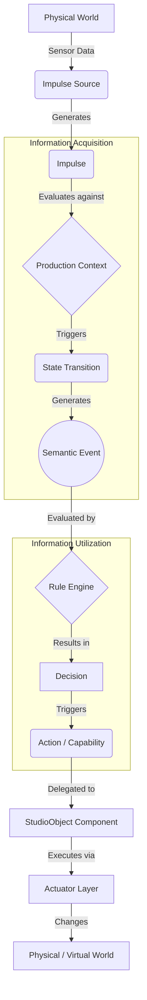

# RVPF Core Specification
**Document ID:** CS-001
**Version:** 0.1 
**Status:** Stable  
**Artifact Type:** Core Specification

---

## 1. Architectural Motivation
Real-time applications currently form the foundation of modern Virtual Production systems. Cameras, tracking systems, lighting, audio, sensors, and user inputs continuously generate technical information that is processed in real-time. 

In existing systems, this processing is predominantly device- or implementation-specific. The meaning of a signal is often directly coupled to its technical origin. This results in tightly coupled systems whose behavior is difficult to reuse, port, or scale.

The **Responsive Virtual Production Framework (RVPF)** takes a different approach. It strictly separates the technical origin of information from its semantic meaning. Technical inputs are initially treated merely as **Impulses**. Only their interpretation within a specific production context leads to semantic **Events**, which then determine the behavior of a real-time application.

This creates a domain-driven architecture that describes production-technical information independently of concrete devices, communication protocols, or target platforms.

**Normative Statement:**  
*This specification does not describe the implementation of a specific real-time environment, but rather the domain architecture of a universal model for processing production-technical information.*

---

## 2. Purpose
The RVPF exists to extend Virtual Production systems with domain-oriented processing of production-technical information. 

It provides a unified middleware that captures impulses from any technical source, interprets them within their production context, and transforms them into semantic events. These events enable the responsive and interactive control of real-time environments independent of the underlying hardware or software.

---

## 3. Document Scope
**This document defines:**
* The normative principles of the RVPF.
* The fundamental concepts governing semantic information processing.
* The architectural constraints shared by all RVPF artifacts.
* The mandatory requirements (Conformance) for all compliant RVPF implementations.

**This document explicitly does not define:**
* Domain-specific terminology (See `GLS-001`).
* Detailed domain models (See `/models` directory).
* Reference architectures or implementation strategies.
* Hardware devices or communication protocols.

---

## 4. Core Principles
The following principles are normative and timeless. Every architecture derived from the RVPF must adhere to these rules:

* **Principle 1: Impulses have no initial semantic meaning.**  
  An impulse exclusively represents temporally occurring information. Only its interpretation within a context grants it semantic meaning.
* **Principle 2: Context determines meaning.**  
  The meaning of an impulse is derived exclusively from the current production context.
* **Principle 3: Events describe state transitions.**  
  An event describes the semantic interpretation of a change within a context state. Signals alone do not generate events.
* **Principle 4: Capabilities describe functions, not devices.**  
  The framework models functions via Capabilities. Concrete hardware merely provides implementations of these capabilities.
* **Principle 5: StudioObjects are the central domain entity.**  
  All physical and virtual components of a production are represented as `StudioObjects`.
* **Principle 6: Technical implementations are interchangeable.**  
  The processing of semantic information occurs independently of runtime engines, hardware, or communication protocols.

---

## 5. RVPF Information Processing Pipeline
The following model describes the causal chain of information processing within the framework[cite: 13, 28, 34]:

## 6. Conformance
### 6.1 Purpose
This chapter defines the minimum requirements that an architecture or implementation must fulfill to be considered compliant with the RVPF Core Specification.

### 6.2 Conformance Requirements
An RVPF-compliant implementation **SHALL**:
* preserve the separation between technical impulses and semantic interpretation.
* interpret impulses within a production context.
* represent production entities as StudioObjects.
* describe behaviour through Capabilities instead of device-specific logic.
* preserve the semantic processing pipeline defined by this specification.
* separate domain logic from implementation-specific device communication.
* remain independent of concrete runtime technologies, communication protocols, and hardware implementations.

### 6.3 Non-Conformance
An implementation is **NOT** RVPF-compliant if it:
* processes technical signals directly as semantic/business events.
* couples devices directly with each other.
* integrates domain logic into communication adapters.
* bypasses the defined semantic processing pipeline.
* replaces StudioObjects with device-specific classes.