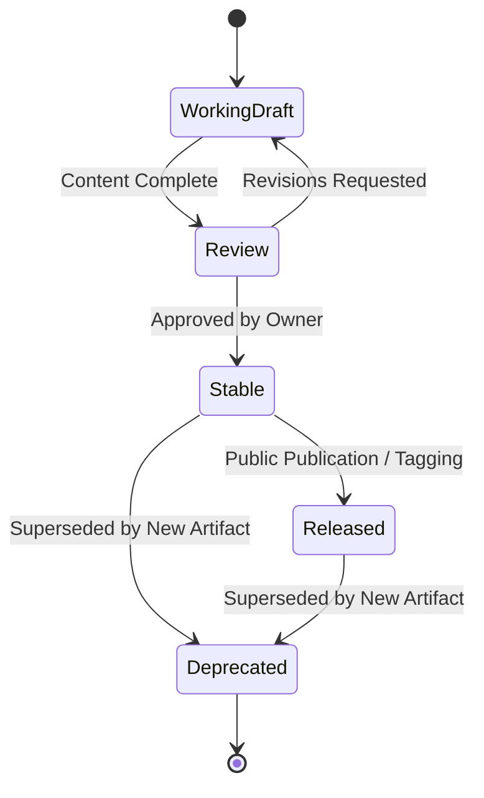
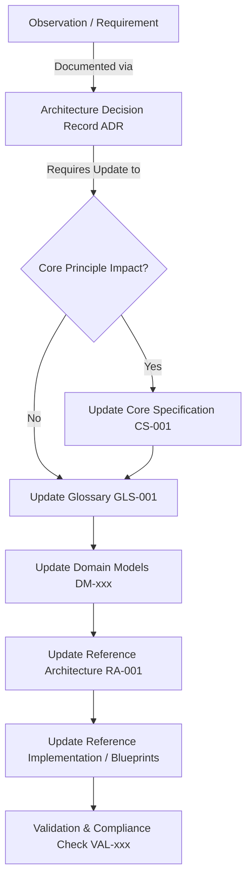

# RVPF Governance Specification
**Document ID:** GOV-001  
**Title:** RVPF Governance  
**Version:** 0.1  
**Status:** Stable  
**Artifact Type:** Governance  
**Author:** Olaf Erler  
**Maintainer:** Olaf Erler  
**Artifact Owner:** Olaf Erler  
**Created:** 2026-07-30  
**Last Modified:** 2026-07-30  
**Depends on:** CS-001  
**Referenced by:** All RVPF Artifacts  
**Approval:** Accepted  

---

## 1. Purpose
This document defines the governance framework and maintenance processes for the Responsive Virtual Production Framework (RVPF). It establishes formal rules for how specification artifacts are authored, categorized, versioned, reviewed, approved, and evolved over time to ensure long-term architectural consistency.

---

## 2. Document Scope
**This document defines:**
* Artifact classification and taxonomy (IDs and prefixes).
* Artifact lifecycle states and approval transitions.
* Versioning strategies and semantics.
* Mandatory traceability requirements across normative artifacts.
* The formal change management process.

**This document explicitly does not define:**
* Domain-specific terminology (See `GLS-001`).
* Domain models or behavioral semantics (See `/models`).
* Reference architectures or technical implementations (See `RA-001` and `/RVPF_UnrealProject`).

---

## 3. Artifact Taxonomy and Prefixes
Every official document within the RVPF repository must be classified under an official artifact type and use a standardized identifier prefix.

| Prefix | Artifact Type | Description | Normative Level |
| :--- | :--- | :--- | :--- |
| **VSN** | Vision | High-level philosophy, scope, and strategic objectives | Informative |
| **CS** | Core Specification | Timeless principles and fundamental constraints | Normative |
| **RA** | Reference Architecture | Layered architectural structure and responsibilities | Normative |
| **GLS** | Glossary | Authoritative domain terminology and definitions | Normative |
| **DM** | Domain Model | Structural and behavioral models of domain entities | Normative |
| **IL** | Implementation Layer | Device inventories, adapter mappings, and protocols | Informative / Reference |
| **ADR** | Architecture Decision Record | Documented architectural decisions and trade-offs | Normative |
| **TMP** | Template | Formal structural blueprints for RVPF artifacts | Normative |
| **GOV** | Governance | Process specifications, lifecycle rules, and standards | Normative |
| **UC** | Use Case | Concrete production scenarios and execution flows | Informative / Example |
| **VAL** | Validation | Test suites and conformance evaluation criteria | Normative |

---

## 4. Artifact Lifecycle and Status
Artifacts undergo a formal lifecycle from initial concept to deprecation.

| Status | Description | Modifiability |
| :--- | :--- | :--- |
| **Working Draft** | Artifact is actively being created or revised. | Unrestricted changes. |
| **Review** | Artifact undergoes formal review against core principles. | Minor clarifications only. |
| **Stable** | Content is finalized, consistent, and architecturally verified. | Frozen; requires formal change process. |
| **Released** | Formally published baseline (e.g., v1.0.0 release candidate). | Read-only; tagged in repository. |
| **Deprecated** | Artifact is obsolete or superseded by a newer specification. | Historical reference only. |

---

## 5. Approval Process
Modifications to normative artifacts require authorization by the designated **Artifact Owner**.

1. **Submission:** A contributor submits a proposal or modified artifact in the `Working Draft` state.
2. **Review:** The artifact is verified against the Core Specification (`CS-001`) and the Glossary (`GLS-001`).
3. **Approval:** The Artifact Owner accepts the architectural changes, transitioning the status to `Stable`.

---

## 6. Versioning Scheme
The RVPF adheres to Semantic Versioning (`MAJOR.MINOR.PATCH`) for all specification artifacts:

* **MAJOR (X.0.0):** Fundamental architectural paradigm shifts, structural breaks in core models, or backward-incompatible changes to normative specifications.
* **MINOR (0.X.0):** Addition of new domain models, capabilities, use cases, or non-breaking architectural extensions.
* **PATCH (0.0.X):** Editorial fixes, formatting adjustments, minor textual clarifications, and errata.

---

## 7. Traceability Requirements
To ensure continuous auditability and prevent specification drift, every normative artifact (`CS`, `RA`, `GLS`, `DM`, `GOV`, `TMP`, `VAL`) **SHALL** declare:

* **Document ID & Metadata:** Unique identifier, version, status, and author/owner.
* **Depends on:** Direct upstream specifications required for validity.
* **Referenced by:** Downstream specifications and models utilizing this artifact.
* **Normative References:** Mandatory foundational standards (e.g., `CS-001`, `VSN-001`).

---

## 8. Change Management Process
Architectural modifications follow a strict top-down propagation process. A change must not be implemented in code before it is formalized in the specification.

1. **Decision Capture:** The proposed change and its trade-offs are documented in a new `ADR-xxx`.
2. **Normative Harmonization:** If principles are affected, `CS-001` and `GLS-001` are updated first.
3. **Domain Alignment:** Affected Domain Models (`DM-*`) are adjusted to reflect the change.
4. **Implementation & Validation:** Blueprints/code are updated to realize the new model, followed by validation against reference scenarios.

---

## 9. Related Artifacts & Normative References
* **VSN-001:** RVPF Vision *(Foundational Context)*
* **CS-001:** RVPF Core Specification *(Normative Basis)*
* **GLS-001:** RVPF Glossary *(Terminology Basis)*
* **TMP-001:** RVPF Artifact Template *(Structural Conformance)*
