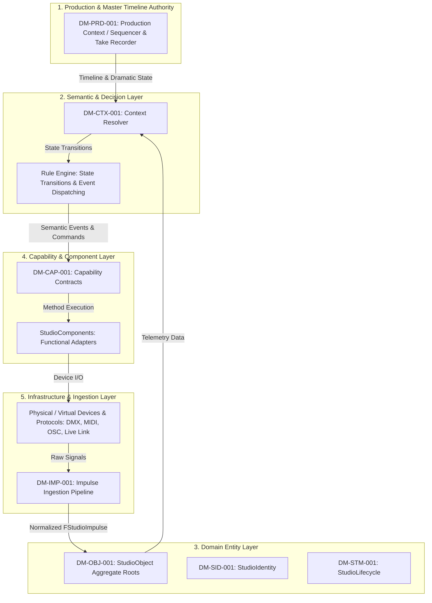
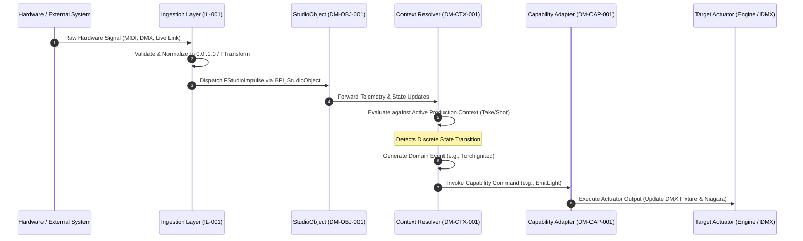

# RVPF System Specification: Reference Architecture
**Document ID:** RA-001  
**Title:** RVPF Reference Architecture Specification  
**Version:** 0.1  
**Status:** Stable  
**Artifact Type:** Reference Architecture  
**Author:** Olaf Erler  
**Maintainer:** Olaf Erler  
**Artifact Owner:** Olaf Erler  
**Created:** 2026-08-27  
**Last Modified:** 2026-08-27  
**Depends on:** CS-001, GLS-001, ADR-001, ADR-002, ADR-003, ADR-004  
**Referenced by:** IL-001, Implementation Specifications  
**Approval:** Accepted  

---

## 1. Purpose
The Reference Architecture establishes the authoritative structural blueprint and system topology for the Responsive Virtual Production Framework (RVPF). It translates the axiomatic rules of the Core Specification (`CS-001`) and the architectural decisions (`ADR-001` to `ADR-004`) into a layered, technology-agnostic software architecture. 

The architecture models the framework as a domain-oriented middleware based on a Ports-and-Adapters (Hexagonal) pattern, strictly decoupling physical/virtual hardware protocols from semantic production logic.

---

## 2. Document Scope
**This document defines:**
* The normative 5-tier architecture layer model and their boundary constraints.
* The end-to-end information processing and causality pipeline.
* The central orchestration roles (`StudioObject`, `ContextResolver`, `Master Timeline Authority`).
* The structural implementation mapping for real-time execution engines.

**This document explicitly does not define:**
* Concrete hardware protocol implementations or socket drivers (See `IL-001`).
* Engine-specific Blueprint nodes or C++ class declarations (See `/RVPF_UE`).
* Individual production narrative states (See `DM-PRD-001`).

---

## 3. Normative References
| ID | Title | Relation / Description |
| :--- | :--- | :--- |
| **CS-001** | Core Specification | Foundational principles and architectural constraints |
| **GLS-001** | Glossary | Authoritative domain terminology |
| **ADR-001 – ADR-004** | Architecture Decision Records | Formal decisions on State Separation, Impulses, Transitions, and Master Timeline |
| **DM-PRD-001 – DM-STM-001** | Domain Models | Specifications for Production, Context, Impulse, Capability, and State |

---

## 4. Architectural Layer Model
The RVPF is structured into five strictly isolated horizontal layers. Information flows deterministically across defined interface boundaries.

---

### 4.1 Layer Responsibilities & Invariants
| Layer | Architectural Responsibility | Key Invariant |
| :--- | :--- | :--- |
| **1. Production Layer** | Maintains the temporal ground truth, timecode authority, and dramatic context (`Scene`, `Shot`, `Take`). | Independent of physical studio hardware. |
| **2. Semantic Layer** | Resolves raw telemetry against active context, validates state transitions, and dispatches domain events. | Business logic resides exclusively here, never in hardware drivers. |
| **3. Domain Entity Layer** | Houses the `StudioObject` Aggregate Roots, encapsulating identity, operational lifecycles, and capabilities. | Free of protocol parsing logic (`ADR-001`). |
| **4. Capability Layer** | Exposes normalized functional interfaces (`Emit`, `Capture`, `Track`, `Interact`, etc.). | Models *what* can be done, not what a device is. |
| **5. Infrastructure Layer** | Ingests hardware packets, scales values into normalized ranges, and bridges external buses. | Strictly decoupled from domain business rules (`ADR-002`). |

---

## 5. End-to-End Information Processing Pipeline
System execution follows a strict causality chain from physical or virtual stimulus to hardware/digital reaction:

---

## 6. Implementation Mapping (Real-Time Application Reference)
The RVPF specification is platform-agnostic. The following mapping establishes conformance for Unreal Engine 5 as the primary reference implementation:

| RVPF Architectural Construct  | Unreal Engine 5 Reference Implementation                   | Architectural Pattern                       |
| :---------------------------- | :------------------------------------------------------------------ | :------------------------------------------ |
| **StudioObject**              | `AActor` / `BP_StudioObjectBase`                        | Aggregate Root (DDD)                        |
| **StudioIdentity**            | `FStudioIdentity` (USTRUCT)                                | Value Object                                |
| **StudioLifecycle**           | `UStudioLifecycleComponent` / Native State Machine      | State Pattern                               |
| **Capability**                | `UBPI_Capability` / `UStudioCapabilityComponent`        | Interface / Strategy Pattern |
| **Impulse Vector**            | `FStudioImpulse` (USTRUCT)                                          | Data Transfer Object (DTO)         |
| **Public Interface**          | `UBPI_StudioObject` (UInterface)                        | Facade / Port Interface         |
| **Context Resolver**          | `UContextManagerSubsystem` / GameInstance Subsystem        | Mediator / Broker Pattern                   |
| **Master Timeline Authority** | `ULevelSequencePlayer` & `UTakeRecorder`                   | Master Clock Authority             |
| **Device Adapters**           | `UDMXComponent`, `ULiveLinkComponent`, `UMidiComponent` | Adapter Pattern                             |

---

## 7. Traceability Mapping
| Core Principle / Decision | Realized In / Handled By | Conformance Criteria |
| :--- | :--- | :--- |
| **Principle 1 & ADR-002: Neutral Impulses** | Section 4 (Layer 5) & Section 5 (Steps 1–3) | Raw inputs are normalized before entering domain objects. |
| **Principle 2 & ADR-004: Context & Timeline Authority** | Section 4 (Layer 1 & 2) | Signals are evaluated exclusively against the active dramatic and temporal state. |
| **Principle 3 & ADR-003: Events from Transitions** | Section 5 (Steps 5–7) | High-frequency telemetry updates state metrics; events fire strictly on boundary crossings. |
| **Principle 4 & 5: StudioObjects & Capabilities** | Section 4 (Layer 3 & 4) & Section 6 | Unified aggregate root; capabilities model abstract functional contracts. |
| **Principle 6 & ADR-001: Decoupled Implementations** | Section 4 (Layer 4 & 5) & Section 6 | Changing physical hardware does not alter domain logic or interface contracts. |