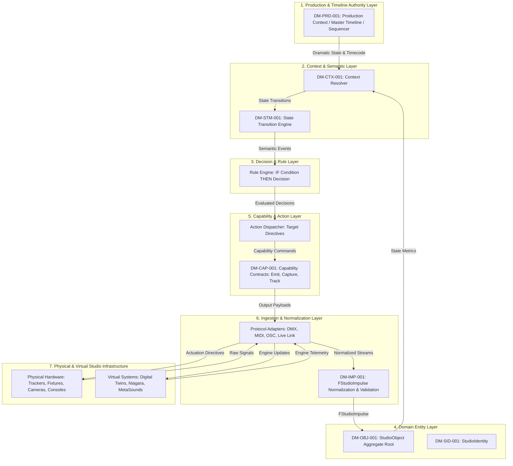
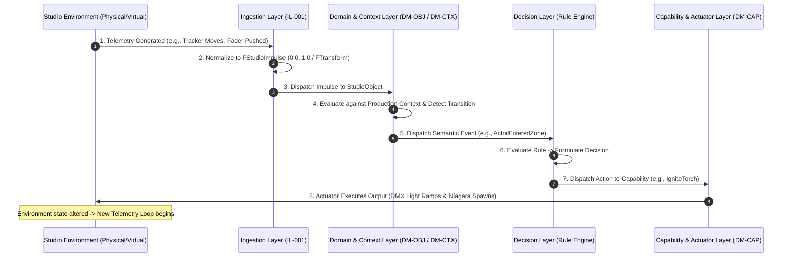

# RVPF System Specification: Layer Model and Information Processing Pipeline
**Document ID:** RA-002  
**Title:** RVPF Layer Model, Data Flow, and Control Flow Specification  
**Version:** 0.1  
**Status:** Stable  
**Artifact Type:** Reference Architecture  
**Author:** Olaf Erler  
**Maintainer:** Olaf Erler  
**Artifact Owner:** Olaf Erler  
**Created:** 2026-08-27  
**Last Modified:** 2026-08-27  
**Depends on:** CS-001, GLS-001, ADR-001, ADR-002, ADR-003, ADR-004  
**Referenced by:** RA-001, IL-001, Implementation Specifications  
**Approval:** Accepted  

---

## 1. Purpose
This specification formally defines the layered architecture, continuous data flow, and deterministic control flow of the Responsive Virtual Production Framework (RVPF)[cite: 1]. The framework models cyber-physical studio interactions as an end-to-end information processing pipeline, separating physical/virtual telemetry from semantic production logic and deterministic actuation.

---

## 2. Document Scope
**This document defines:**
* The static horizontal layer model and individual layer responsibilities.
* The directional, protocol-agnostic Data Flow (Telemetry Ingestion to Normalization).
* The semantic Control Flow and decision pipeline (Context Evaluation to Actuator Dispatch).
* The Closed-Loop Causality Cycle between the physical studio environment and real-time engine state.

**This document explicitly does not define:**
* Low-level driver code or network socket implementations (See `IL-001`)[cite: 1].
* Engine-specific Blueprint nodes or C++ class declarations (See `/RVPF_UE`).
* Narrative production scripts or shot breakdowns (See `DM-PRD-001`)[cite: 1].

---

## 3. Normative References
| ID | Title | Relation / Description |
| :--- | :--- | :--- |
| **CS-001** | Core Specification | Foundational principles (Principles 1–6)[cite: 1] |
| **GLS-001** | Glossary | Authoritative domain terminology (`Impulse`, `Context`, `Event`, `Rule`, `Action`)[cite: 1] |
| **ADR-001 – ADR-004** | Architecture Decision Records | Foundational decisions on State Separation, Neutral Impulses, Transitions, and Master Timeline[cite: 1] |
| **DM-PRD-001 – DM-STM-001** | Domain Models | Normative models for Production, Context, Impulse, Capability, and State[cite: 1] |

---

## 4. Architectural Layer Model
The RVPF separates concerns across seven structured horizontal tiers, strictly isolating domain semantics from hardware transports.

---
### 4.1 Layer Responsibilities
| Layer | Name | Primary Responsibility | Key Invariant |
| :--- | :--- | :--- | :--- |
| **L1** | **Production & Timeline** | Provides master timecode, play state, and dramatic hierarchy (Scene, Shot, Take). | Serves as the overarching ground truth for context evaluation. |
| **L2** | **Context & Semantic** | Evaluates incoming telemetry against production state to detect discrete state transitions. | Dispatches events strictly upon verified context changes (`ADR-003`). |
| **L3** | **Decision & Rule** | Evaluates declarative rules (`IF <Event> AND <Condition> THEN <Decision>`). | Decouples event detection from target actuator execution. |
| **L4** | **Domain Entity** | Manages `StudioObject` identities, operational lifecycles, and capabilities. | Excludes protocol-specific parsing logic (`ADR-001`). |
| **L5** | **Capability & Action** | Executes abstract functional contracts (`Emit`, `Capture`, `Track`). | Hardware-agnostic operational surface (`DM-CAP-001`). |
| **L6** | **Ingestion & Normalization** | Validates and maps heterogeneous hardware signals into normalized ranges (0.0–1.0, transforms). | Strips protocol dependencies (`ADR-002`). |
| **L7** | **Physical & Virtual Infrastructure** | Studio devices, capture rigs, emitters, render viewports, and virtual digital twins. | Target of sensing and final actuator output. |

---

## 5. End-to-End Data and Control Flow

```mermaid
flowchart LR
    subgraph Data_Flow [Data Ingestion Pipeline]
        S[Physical/Virtual Sensor] -->|Raw Hardware Signal| A[Protocol Adapter]
        A -->|Validate CRC/Time| V[Validation]
        V -->|Scale 0.0..1.0 / Transform| N[Normalization]
        N -->|FStudioImpulse| SO[StudioObject]
    end

    subgraph Control_Flow [Semantic Control & Execution Pipeline]
        SO -->|Forward Telemetry| CR[Context Resolver]
        CR -->|Context State Change| EV((Semantic Event))
        EV -->|Trigger| RE[Rule Engine]
        RE -->|Evaluate Conditions| DC[Decision]
        DC -->|Command Execution| AC[Action Dispatcher]
        AC -->|Invoke Method| CAP[Target Capability]
        CAP -->|Actuation Output| ACT[Physical/Virtual Actuator]
    end
```

---
### 5.1 Step-by-Step Execution Sequence
1. **Stimulus Ingestion:** Physical sensors or user interfaces generate raw signals (e.g., MIDI CC, DMX packets, Live Link transforms).
2. **Validation & Normalization:** Ingestion adapters check payload integrity and map data into normalized ranges (`FStudioImpulse`).
3. **Impulse Dispatch:** Normalized impulses enter the framework via `BPI_StudioObject:HandleImpulse`.
4. **Context Evaluation:** The `ContextResolver` evaluates normalized metrics against the active `ProductionContext` (`Take`, `Shot`, `Timecode`).
5. **State Transition & Event Generation:** Crossing a semantic threshold transitions the context state and fires an immutable domain `Event` (`ADR-003`).
6. **Rule Evaluation & Decision:** The Rule Engine evaluates active production conditions and outputs a formal `Decision`.
7. **Action Dispatch & Execution:** The action dispatcher invokes commands on target `Capabilities` (`Emit`, `Capture`), altering physical fixtures or engine parameters.

---

## 6. Closed-Loop Causality Cycle
The framework functions as a closed cyber-physical control loop. Actuator outputs directly modify the studio environment, producing new sensor telemetry for subsequent pipeline cycles.

---
## 7. Traceability Mapping
| Architectural Principle | Realized In / Handled By | Conformance Criteria |
| :--- | :--- | :--- |
| **Principle 1 & ADR-002: Neutral Impulses**[cite: 1] | Section 5 (Data Flow Steps 1–3)[cite: 1] | Ingested inputs carry no direct business logic until contextualized[cite: 1]. |
| **Principle 2 & ADR-004: Context & Master Timeline**[cite: 1] | Section 4 (L1/L2) & Section 5.1 (Step 4)[cite: 1] | Telemetry interpretation strictly depends on active production hierarchy and timeline state[cite: 1]. |
| **Principle 3 & ADR-003: Events from Transitions**[cite: 1] | Section 5 (Control Flow) & Section 6 (Step 4–5)[cite: 1] | Continuous telemetry streams update state without firing events until boundaries change[cite: 1]. |
| **Principle 4 & 5: StudioObjects & Capabilities**[cite: 1, 3, 7] | Section 4 (L4/L5) & Section 5.1 (Steps 3, 7)[cite: 1, 7] | Operations are executed via abstract capability contracts on unified aggregate roots[cite: 1, 7]. |
| **Principle 6 & ADR-001: Decoupled Hardware**[cite: 1] | Section 4 (L6/L7) & Section 6[cite: 1] | Protocol and driver changes do not affect semantic evaluation or rule definitions[cite: 1, 7]. |

