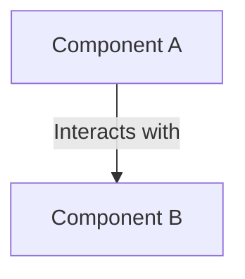

# [Artifact Title]
**Document ID:** [e.g., DM-CTX-001]  
**Title:** [Artifact Title]  
**Version:** 0.1  
**Status:** Working Draft  
**Artifact Type:** [e.g., Domain Model | Core Specification | Reference Architecture]  
**Author:** Olaf Erler  
**Maintainer:** Olaf Erler  
**Artifact Owner:** Olaf Erler  
**Created:** 2026-08-27  
**Last Modified:** 2026-08-27  
**Depends on:** [e.g., CS-001]  
**Referenced by:** [e.g., All RVPF Artifacts]  
**Approval:** Working Draft  

---

## 1. Purpose
[Describe the authoritative purpose of this artifact. Why does it exist and what role does it serve within the RVPF ecosystem?]

---

## 2. Document Scope
**This document defines:**
* [Itemized list of concepts, models, or constraints explicitly defined by this document]

**This document explicitly does not define:**
* [Itemized list of concepts or technical implementations excluded from this scope]

---

## 3. Normative References
The following documents are foundational and indispensable for the application of this artifact:

| ID | Title | Relation / Description |
| :--- | :--- | :--- |
| **CS-001** | RVPF Core Specification | Normative Foundation |
| **GLS-001** | RVPF Glossary | Terminology and Definitions |
| **GOV-001** | RVPF Governance | Lifecycle and Versioning Rules |

---

## 4. Related Artifacts
| ID | Title | Relation |
| :--- | :--- | :--- |
| **[Artifact ID]** | [Artifact Title] | [e.g., Concretizes / Implements / Extends] |

---

## 5. Revision History
| Version | Date | Status | Description of Changes |
| :--- | :--- | :--- | :--- |
| 0.1 | 2026-08-27 | Working Draft | Initial document creation |

---

## 6. [Primary Section Title]
[Document core content, models, structural descriptions, and specifications.]

### 6.1 [Subsection Title]
[Detailed text, tables, or Mermaid diagrams describing the domain entities.]

---
## 7. Traceability Mapping
| Core Principle / Requirement | Realized In / Handled By | Conformance Criteria |
| :--- | :--- | :--- |
| **Principle 1: Impulses have no semantic meaning**[cite: 28] | `FStudioImpulse` / `DM-IMP-001`[cite: 28, 30] | Raw sensor data is ingested without attached business logic[cite: 28]. |
| **Principle 2: Context determines meaning**[cite: 28] | `ContextResolver` / `DM-CTX-001`[cite: 28] | Impulses are evaluated against production state (Shot, Take, Timeline)[cite: 28]. |
| **Principle 3: Events describe state transitions**[cite: 28] | `ContextEngine` / `DM-STM-001`[cite: 28] | Events are dispatched exclusively upon context state changes[cite: 28]. |
| **Principle 4: Capabilities describe functions**[cite: 28] | `ECoreCapability` / `DM-CAP-001`[cite: 28, 30] | Operations are modeled via abstract capabilities, not concrete device types[cite: 28, 30]. |
| **Principle 5: StudioObjects as core entities**[cite: 28] | `BPI_StudioObject` / `DM-OBJ-001`[cite: 28, 30] | All physical/virtual studio elements are represented as aggregate StudioObjects[cite: 28, 30]. |
| **Principle 6: Interchangeable implementations**[cite: 28] | `StudioComponent` / `DeviceAdapters`[cite: 28, 30] | Business logic remains isolated from hardware communication protocols[cite: 28]. |