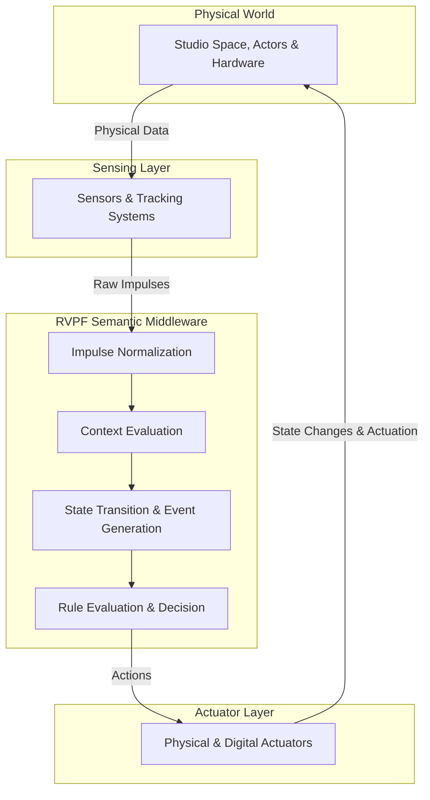

# RVPF Vision Specification
**Document ID:** VSN-001  
**Title:** RVPF Vision  
**Version:** 0.1  
**Status:** Stable  
**Artifact Type:** Vision  
**Author:** Olaf Erler  
**Maintainer:** Olaf Erler  
**Artifact Owner:** Olaf Erler  
**Created:** 2026-07-30  
**Last Modified:** 2026-07-30  
**Depends on:** None  
**Referenced by:** All RVPF Artifacts  
**Approval:** Accepted  

---

## 1. Purpose
The Responsive Virtual Production Framework (RVPF) provides a domain-oriented foundation for the design, integration, and execution of responsive real-time production environments.

Its vision is to transform isolated technical inputs into semantically meaningful production events by interpreting them within their current production context. This enables heterogeneous physical and digital systems to interact through a common conceptual model rather than through device-specific implementations.

The framework promotes a technology-independent approach to responsive virtual production by separating production semantics from hardware, software, and communication protocols. It establishes a common architectural language that supports reusable, context-aware, and interoperable production workflows.

Beyond its application in virtual production, the RVPF serves as a research and educational platform for investigating responsive cyber-physical systems, real-time interaction, and semantic middleware architectures. Its objective is to provide a stable conceptual foundation that remains applicable across future technologies, production environments, and application domains.

---

## 2. Mission Statement
> **The RVPF transforms isolated technical inputs into semantically meaningful production events through context-aware interpretation.**

---

## 3. Document Scope
**This document defines:**
* The long-term vision of the RVPF.
* Its strategic objectives.
* Its application domain (Film, Broadcast, Interactive Stages, Location-Based Experiences).
* Its guiding architectural philosophy (Cyber-Physical Systems approach).

**This document explicitly does not define:**
* Concrete architectural concepts (See `CS-001` and `RA-001`).
* Terminology definitions (See `GLS-001`).
* Detailed domain models (See `/models`).
* Reference architectures or implementation details (See `/RVPF_UnrealProject`).

---

## 4. Guiding Architectural Philosophy: The Studio as a CPS
The RVPF conceptualizes the studio not as an arbitrary collection of technical devices, but as an information-processing Cyber-Physical System (CPS)[cite: 12].

Physical entities (actors, cameras, tracking systems, lighting, acoustic environments) are continuously captured via sensors[cite: 12]. These technical measurements are normalized and interpreted within a digital middleware context. The resulting semantic decisions control digital or physical actuators, closing the control loop back to the physical world.

## 5. Strategic Objectives
* **Hardware-Agnostic Abstraction:** Decouple production business logic completely from device protocols (DMX, MIDI, OSC, Live Link)[cite: 2, 12, 28].
* **Context-Driven Semantics:** Process technical inputs dynamically based on the dramatic and chronological state of the production timeline (Sequencer/Take Recorder)[cite: 2, 28].
* **Unified Domain Language:** Establish an authoritative specification language for responsive cyber-physical production environments across research, education, and industry[cite: 2, 28].
* **Universal Portability:** Enable deployment across diverse real-time engines and production topologies (Greenscreen Studios, LED Volumes, Interactive Exhibitions, Location-Based Experiences)[cite: 2, 28].

---

## 6. Related Artifacts & Normative References
* **CS-001:** RVPF Core Specification *(Normative Foundation)*[cite: 2]
* **GLS-001:** RVPF Glossary *(Terminology Reference)*[cite: 2]
* **RA-001:** RVPF Reference Architecture *(Structural Realization)*[cite: 2]
* **TMP-001:** RVPF Artifact Template *(Structural Conformance)*[cite: 3]