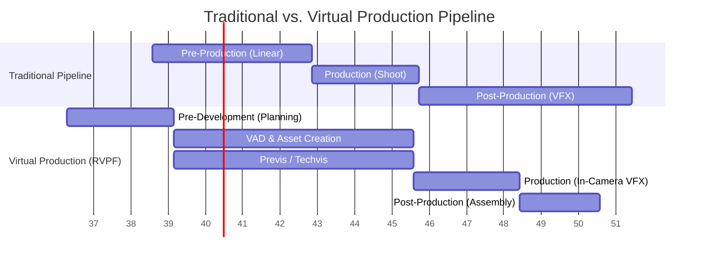

## Chapter 2: Pre-Development and Workflow Architecture

The transition from a traditional film pipeline to a Virtual Production (VP) pipeline is characterized by a fundamental shift from a sequential, linear "waterfall" process to a parallel, iterative, and highly collaborative workflow. Central to this transition is the emergence of a critical new phase: *Pre-Development*.

### 1. The Pre-Development Phase (The "Planning Paradox")

In traditional filmmaking, the workflow progresses relatively linearly from script development to pre-production, production, and finally post-production (An, 2022). VP disrupts this linearity, requiring substantial technical and creative groundwork to be completed *before* formal pre-production begins. This phase is often referred to as the "planning paradox"—preparing to prepare.

* **Defining Scope and Feasibility:** Before entering pre-production, stakeholders must evaluate if their creative intent is achievable within the constraints of budget, available manpower, and the physical limitations of the LED volume[cite: 1, 2]. 
* **The Role of the Studio Manager:** In this phase, the Studio Manager acts as the central coordinator. They are responsible for evaluating technical constraints, determining required engine plugins, and establishing the communication protocols between traditional production teams and virtual production specialists.
* **Workflow Design as an Activity:** Early VP planning operates as a distinct workflow design activity. Inputs (e.g., concept art, digital assets), responsibilities, and technical interfaces (such as data management and source control) must be defined and documented before execution begins[cite: 1, 4].

---

### 2. The Non-Linear, Parallel Workflow

Virtual Production is an expansion of the traditional filmmaking playbook, allowing creatives to reinvent the process of linear content creation[cite: 6, 14]. By centralizing processes within a real-time game engine, departments that traditionally operated in silos can now work concurrently[cite: 5, 6].

#### 2.1 Shifting Post into Pre
The most significant impact of the VP pipeline is the inversion of labor and resources. Because virtual environments must be captured "in-camera" as final-pixel quality imagery, the creation of 3D assets, lighting setups, and visual effects is shifted from post-production forward into pre-production[cite: 9, 10, 14]. 
* **Fixing it in Pre:** The industry adage changes from "fix it in post" to "fix it in pre"[cite: 9, 15]. Decisions regarding compositing, set dressing, and lighting are finalized interactively on set, drastically reducing downstream rendering and compositing bottlenecks[cite: 1, 5, 9].

#### 2.2 Agile and Iterative Processes
The workflow mimics agile software development. Storyboarding, look development, and environment creation happen simultaneously in a dynamic process, using the game engine as an interactive "playground". This continuous feedback loop ensures that the final vision is continuously refined[cite: 14].

#### Workflow Comparison Diagram

The following diagram illustrates the structural shift from a traditional pipeline to a parallel Virtual Production pipeline.

### 3. Pipeline Integration and Techvis

While different roles (e.g., a Production Designer and an Unreal Engine Operator) may follow distinct pipelines during the planning stages, their workflows must converge precisely before principal photography. This point of convergence relies heavily on Previs (Previsualization) and Techvis (Technical Visualization).

- **Previs as a Decision-Support Mechanism:** In traditional film, storyboards and shot lists are conceptual. In VP, previs is an operational phase[cite: 1]. By visualizing the whole virtual world in the engine, the director can make real-time decisions on camera angles, lens choices, lighting, and pacing.
    
- **Techvis (Technical Visualization):** Techvis validates the creative choices against the physical constraints of the stage[cite: 6]. It ensures that the virtual assets do not extend beyond the physical plane of the LED wall and that physical sets align seamlessly with their digital extensions.
    
- **System Layers:** To maintain engine stability during these converged workflows, technical directors must respect the architectural layers of the engine (e.g., separating core resource management from gameplay logic or UI tools) to ensure performance scalability.
    

### 4. Cross-Departmental Interdependencies

Virtual production forces a high degree of interdependency between physical and digital departments.

- **Physical & Virtual Synchronization:** If a scene requires rain or wind (managed by the physical SFX department), the engine operator must synchronize the digital environment (e.g., moving foliage, particle effects) to match the practical effects exactly[cite: 1].
    
- **Data Flow and Review:** Because data flows back and forth in parallel, filmmakers can test creative decisions from the outset. This requires robust versioning, source control (like Perforce Helix Core), and strict naming conventions to ensure that live collaboration does not result in overwritten or corrupted data.
    

### References

- An, J. (2022). _Contemporary Film Production Workflows and Pipeline Transition_.[cite: 1]
    
- Autodesk. (2011). _The New Art of Virtual Moviemaking: Real-Time 3D Animation and Virtual Workflows_.
    
- Epic Games. (2019/2021). _The Virtual Production Field Guide (Vol. 1 & 2)_.[cite: 1, 6, 9]
    
- Jorge, F. (2021). _Definition of VAD and Workflow Integration_. Narwhal Studios.
    
- Priadko and Sirenko. (2021). _Non-linear Workflow Structures in Contemporary Film_.[cite: 1]
    
- Swords, J., & Willment, N. (2024). _Virtual Production Networks: Restructuring the Art Department Pipeline_.[cite: 1]