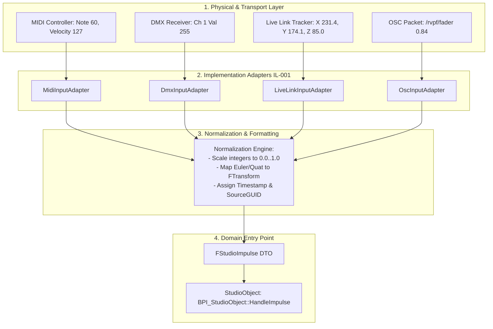
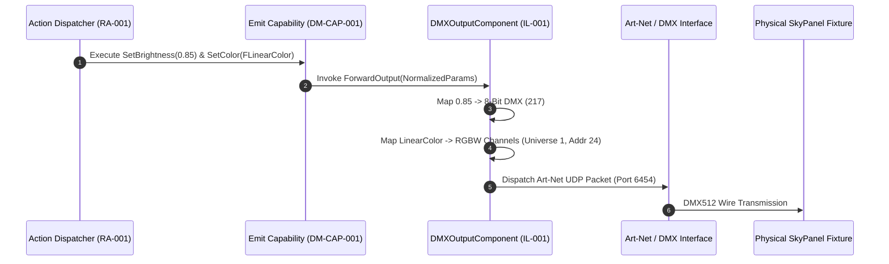

# RVPF System Specification: Implementation Layer
**Document ID:** IL-001  
**Title:** RVPF Implementation Layer & Device Adapter Specification  
**Version:** 0.1  
**Status:** Stable  
**Artifact Type:** Implementation Layer  
**Author:** Olaf Erler  
**Maintainer:** Olaf Erler  
**Artifact Owner:** Olaf Erler  
**Created:** 2026-08-27  
**Last Modified:** 2026-08-27  
**Depends on:** CS-001, GLS-001, ADR-001, ADR-002, RA-001, DM-OBJ-001, DM-IMP-001, DM-CAP-001  
**Referenced by:** Reference Implementations (`/RVPF_UE`)  
**Approval:** Accepted  

---

## 1. Purpose
The Implementation Layer bridges the abstract domain models of the Responsive Virtual Production Framework (RVPF) with physical studio hardware, real-time engines, and concrete communication protocols. 

This specification defines how heterogeneous device signals (DMX, MIDI, OSC, Live Link, FreeD) are ingested, normalized into uniform `FStudioImpulse` streams, and how abstract Capability commands (e.g., `Emit`, `Capture`, `Track`) are translated into concrete protocol payloads without coupling domain logic to underlying hardware drivers.

---

## 2. Document Scope
**This document defines:**
* The authoritative hardware device inventory and studio role mapping.
* The Adapter Architecture for protocol-specific ingestion and output components.
* Concrete normalization and scaling algorithms for continuous and discrete telemetry.
* The technical mapping of abstract capability methods to actuator protocol outputs.

**This document explicitly does not define:**
* Platform-agnostic domain logic or lifecycle state rules (See `DM-OBJ-001`, `DM-STM-001`).
* Semantic context resolution or state transition evaluation (See `DM-CTX-001`).
* Narrative production scene hierarchy (See `DM-PRD-001`).

---

## 3. Normative References
| ID | Title | Relation / Description |
| :--- | :--- | :--- |
| **CS-001** | Core Specification | Foundational principles (Principle 1, 4, 6) |
| **GLS-001** | Glossary | Authoritative domain definitions (`Actuator`, `Sensor`, `Normalization`, `Impulse`) |
| **ADR-001** | Architecture Decision Record | Separation of Domain State from Hardware Communication |
| **ADR-002** | Architecture Decision Record | Semantic Neutrality of Incoming Impulses |
| **DM-IMP-001**| Impulse Model | Specification of the `FStudioImpulse` data structure |
| **DM-CAP-001**| Capability Model | Abstract contracts for `Emit`, `Capture`, `Track`, `Interact` |

---

## 4. Studio Device Inventory & Role Mapping
The Implementation Layer classifies concrete studio hardware into standardized domain roles and capability sets:

| Device ID | Hardware Model | Physical Interface | Protocol / Bus | Domain Role | Attached Capabilities |
| :--- | :--- | :--- | :--- | :--- | :--- |
| **L001** | ARRI SkyPanel S30-C | RJ45 Ethernet | Art-Net / DMX512 | Actuator (Light) | `Emit` (Light), `Configure`, `Monitor` |
| **L002** | ARRI SkyPanel S60-C | RJ45 Ethernet | Art-Net / DMX512 | Actuator (Light) | `Emit` (Light), `Configure`, `Monitor` |
| **L003** | ARRI L7-C Fresnel | 5-Pin XLR DMX | DMX512 / RDM | Actuator (Light) | `Emit` (Light), `Configure` |
| **C001** | Production Camera Rig | SDI / Genlock / USB | Live Link / FreeD / UVC | Sensor (Camera) | `Capture` (Image), `Synchronize`, `Configure` |
| **T001** | HTC Vive Mars Rover / Tracker | USB-C / RF 2.4GHz | SteamVR / Live Link | Sensor (Tracker) | `Track` (Pose), `Synchronize` |
| **I001** | Akai MPK Mini / MIDI Fader | USB-B | MIDI CC / Note On | Sensor (Controller) | `Interact` (Value/Trigger) |
| **V001** | Digital Twin Fixture / Prop | Engine Internal | Direct Blueprint Call | Actuator / Sensor | `Emit` (Niagara), `Track`, `Monitor` |

---

## 5. Input Adapter & Normalization Architecture
Input adapters intercept raw byte streams and convert them into standardized `FStudioImpulse` packages before routing to `BPI_StudioObject:HandleImpulse`.

    
---
### 5.1 Protocol-Specific Normalization Formulas
* **MIDI Continuous Controller (7-Bit):**
  $$Value_{norm} = \frac{CC_{raw}}{127.0}$$
* **MIDI Pitch Bend / High-Resolution (14-Bit):**
  $$Value_{norm} = \frac{Value_{raw}}{16383.0}$$
* **DMX512 Channel Value (8-Bit):**
  $$Value_{norm} = \frac{DMX_{raw}}{255.0}$$
* **DMX512 Fine Channel (16-Bit Coarse/Fine):**
  $$Value_{norm} = \frac{(Coarse \times 256) + Fine}{65535.0}$$
* **Tracking Spatial Transform (SteamVR / Live Link):**
  Converts coordinate space orientation (Right-Handed Z-Up / Y-Up) directly into native engine `FTransform` vectors (Unreal Left-Handed Z-Up, scaled in cm).

---

## 6. Output Actuation Mapping (Capability to Hardware)
Capability execution is strictly decoupled from physical addressing. When an action command is issued to a Capability, the corresponding `StudioComponent` encodes the parameters into hardware payloads.

---
### 6.1 Capability-to-Protocol Dispatch Matrix
| Capability Method | Parameter Types | Target Adapter Component | Output Payload Format | Target Endpoint |
| :--- | :--- | :--- | :--- | :--- |
| `Emit.SetBrightness` | `float` (0.0–1.0) | `UDMXOutputComponent` | 8-Bit / 16-Bit DMX Channel Data | Art-Net / sACN Node |
| `Emit.SetColor` | `FLinearColor` (RGBA) | `UDMXOutputComponent` | RGBW / CCT DMX Footprint | ARRI / Astera Fixture |
| `Emit.TriggerVisualEffect` | `FName`, `float` Intensity | `UNiagaraVFXComponent` | Native Niagara User Parameters | Virtual Environment |
| `Capture.StartRecording` | `FTimecode`, `FString` Take | `UTakeRecorderAdapter` | Engine Sequencer Recording API | Take Recorder Track |
| `Track.UpdateTransform` | `FTransform` | `ULiveLinkSourceComponent` | Live Link Subject Frame Data | Virtual Camera Actor |

---

## 7. Traceability Mapping
| Core Principle / Decision                                        | Realized In / Handled By                            | Conformance Criteria                                                                                                                        |
| :--------------------------------------------------------------- | :-------------------------------------------------- | :------------------------------------------------------------------------------------------------------------------------------------------ |
| **Principle 1 & ADR-002: Neutral Impulses**          | Section 5 (Adapter Pipeline) & Section 5.1 | All hardware protocols are mapped into normalized `FStudioImpulse` before reaching domain logic.                             |
| **Principle 4: Capabilities describe functions**     | Section 6.1 (Dispatch Matrix)              | High-level methods (`SetBrightness`, `SetColor`) are translated into hardware bytes exclusively by components.                     |
| **Principle 6 & ADR-001: Decoupled Implementations** | Section 4 & Section 6                      | Swapping physical fixtures (e.g., SkyPanel to Nanlux) only requires updating component mappings, leaving business logic untouched. |
