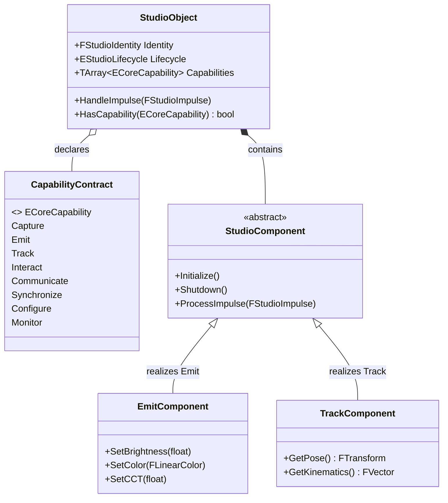

# RVPF Domain Model: Capability Model
**Document ID:** DM-CAP-001  
**Title:** RVPF Capability Model  
**Version:** 0.1  
**Status:** Stable  
**Artifact Type:** Domain Model  
**Author:** Olaf Erler  
**Maintainer:** Olaf Erler  
**Artifact Owner:** Olaf Erler  
**Created:** 2026-08-27  
**Last Modified:** 2026-08-27  
**Depends on:** CS-001, GLS-001  
**Referenced by:** DM-OBJ-001, IL-001, RA-001  
**Approval:** Accepted  

---

## 1. Purpose
The Capability Model defines the functional contract layer of the Responsive Virtual Production Framework (RVPF). It establishes an abstract, hardware-agnostic taxonomy of operations that entities within the production environment can provide or consume. In accordance with Core Principle 4, the framework models behaviors strictly via capabilities rather than concrete device types.

---

## 2. Document Scope
**This document defines:**
* The normative definitions of atomic Core Capabilities.
* The functional separation between Capabilities, Commands, Properties, and Operational States.
* Specializations of Core Capabilities across sensory and actuation domains.
* Compositional rules for attaching capabilities to `StudioObjects`.

**This document explicitly does not define:**
* Concrete hardware communication protocols (DMX, MIDI, OSC, Live Link) (See `IL-001`).
* Component implementations or Blueprint actor logic (See `RA-001` and `/RVPF_UnrealProject`).
* Production context and timeline synchronization states (See `DM-PRD-001`, `DM-CTX-001`).

---

## 3. Normative References
| ID | Title | Relation / Description |
| :--- | :--- | :--- |
| **CS-001** | RVPF Core Specification | Foundational constraints (specifically Principle 4 & Conformance 6.2) |
| **GLS-001** | RVPF Glossary | Authoritative domain terminology (`Capability`, `StudioObject`, `Actuator`, `Sensor`) |
| **GOV-001** | RVPF Governance | Lifecycle, versioning, and approval rules |

---

## 4. Core Capabilities Taxonomy
A Core Capability is an atomic functional contract. A single `StudioObject` may aggregate multiple capabilities to define its operational surface.

| Core Capability | Domain Classification | Description | Architectural Examples |
| :--- | :--- | :--- | :--- |
| **Capture** | Sensing / Ingestion | Acquires data or media streams from the physical or virtual domain. | Camera (Image), Microphone (Audio), Depth Sensors. |
| **Emit** | Actuation / Output | Dispatches energy, light, or media into the physical or virtual environment. | Fixture (Light), Speaker (Audio), LED Wall, Display. |
| **Track** | Sensing / Spatial | Continuously provides transformation, pose, and kinematic telemetry. | Optical Trackers, Vive Mars Rover, MoCap Suits. |
| **Interact** | Input / Control | Ingests direct user actions and provides tactical control feedback. | MIDI Faders, Stream Decks, Gamepads, Push Buttons. |
| **Communicate** | Transport / Protocol | Handles bidirectional network payloads and protocol translation. | DMX/sACN Nodes, OSC Bridges, TCP/UDP Sockets. |
| **Synchronize** | Timing / Temporal | Maintains temporal and phase alignment across devices and clocks. | PTP, Genlock, SMPTE LTC Timecode. |
| **Configure** | Administration | Manages persistent parameters, calibration matrices, and addressing. | Lens profiles, DMX universe offsets, IP settings. |
| **Monitor** | Telemetry / Diagnostics | Observes and reports health, operational metrics, and hardware faults. | Thermal levels, battery percentage, packet loss. |

---

## 5. Architectural Structure: Capabilities as Contracts

---
## 6. Functional Anatomy of a Capability
Every capability models three distinct software tiers, strictly separating intent from state:

1. **Commands (Methods):** Direct instructions dispatched to trigger execution (e.g., `SetBrightness()`, `StartTracking()`).
2. **Properties (Variables):** Normalized internal state values (e.g., `Brightness: 0.0..1.0`, `Pose: Transform`).
3. **Operational Events:** Lifecycle transitions specific to the domain of the capability (e.g., `OnTrackingLost`, `OnThermalLimitExceeded`).

---

## 7. Traceability Mapping
| Core Principle / Constraint | Realized In / Handled By | Conformance Criteria |
| :--- | :--- | :--- |
| **Principle 4: Capabilities describe functions** | `ECoreCapability` Enum & Abstract Components | No hardware-specific classes exist in the domain model; behavior is strictly represented via capabilities. |
| **Principle 6: Interchangeable implementations** | Component Adapter Pattern (`StudioComponent`) | Changing a physical fixture (e.g., ARRI to Nanlux) preserves the identical `Emit` capability interface. |