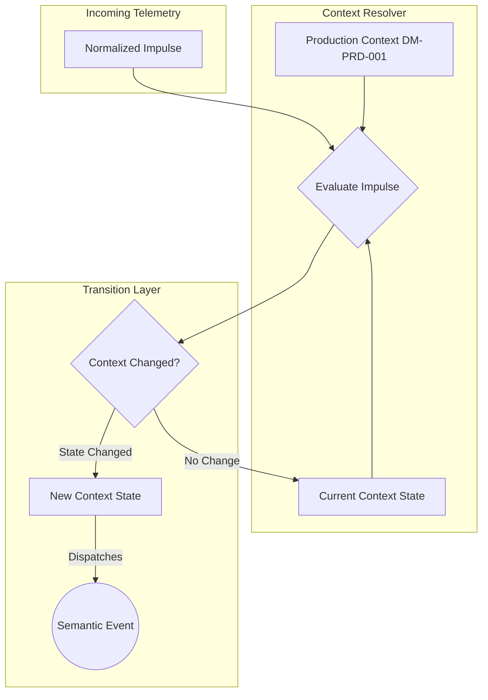

# RVPF Domain Model: Context Model
**Document ID:** DM-CTX-001  
**Title:** RVPF Context Model  
**Version:** 0.1  
**Status:** Stable  
**Artifact Type:** Domain Model  
**Author:** Olaf Erler  
**Maintainer:** Olaf Erler  
**Artifact Owner:** Olaf Erler  
**Created:** 2026-08-27  
**Last Modified:** 2026-08-27  
**Depends on:** CS-001, GLS-001, DM-PRD-001  
**Referenced by:** DM-STM-001, DM-OBJ-001, RA-001  
**Approval:** Accepted  

---

## 1. Purpose
The Context Model defines the semantic interpretation layer of the Responsive Virtual Production Framework (RVPF). In accordance with Core Principle 2, incoming impulses carry no inherent business meaning; their meaning is derived exclusively through interpretation within a defined context. The Context Model transforms raw, normalized data into contextual state representations, which serve as the prerequisite for event generation.

---

## 2. Document Scope
**This document defines:**
* The formal definition and lifecycle of contextual state within the RVPF.
* The taxonomy of primary Context Classes (Spatial, Temporal, Device, User, Environment, Interaction, Relationship, System).
* The Context Transition Model (evaluating state changes before and after impulse arrival).
* The role of the Context Resolver in evaluating multi-dimensional states.

**This document explicitly does not define:**
* Concrete hardware communication or network protocols (See `IL-001`).
* The internal structure of raw sensor payloads (See `DM-IMP-001`).
* Rule execution logic or actuator commands (See `RA-001`).

---

## 3. Normative References
| ID | Title | Relation / Description |
| :--- | :--- | :--- |
| **CS-001** | RVPF Core Specification | Foundational principles (Principle 2: Context determines meaning) |
| **GLS-001** | RVPF Glossary | Authoritative terminology (`Context`, `Impulse`, `State Transition`, `Event`) |
| **DM-PRD-001** | Production Model | The root temporal and dramatic framework (Production, Scene, Shot, Take) |

---

## 4. Context Definition and Taxonomy
A Context describes the semantic meaning of one or more `StudioObjects` resulting from the interpretation of incoming impulses within the current production environment.

| Context Class | Scope of Description | Example Conditions / States |
| :--- | :--- | :--- |
| **Spatial Context** | Physical or virtual locations, zones, boundaries, and spatial proximity. | `ActorInsideStage`, `DistanceToTorch < 0.5m` |
| **Temporal Context** | Timecode, elapsed durations, countdowns, and timeline positions. | `RecordingRunning`, `CountdownExpired` |
| **Device Context** | Operational and technical health states of connected infrastructure. | `CameraConnected`, `TrackingAvailable` |
| **User Context** | Operator presence, active roles, credentials, and focus. | `PresenterActive`, `OperatorLoggedIn` |
| **Environment Context** | Physical studio conditions (ambient lighting, temperature, doors). | `StudioOccupied`, `StageDoorOpen` |
| **Interaction Context** | Tactical input states originating from human-machine interfaces. | `ButtonHeld`, `FaderActive` |
| **Relationship Context** | Semantic links and dependencies between distinct entities. | `CameraObservesActor`, `RoverControlsTorch` |
| **System Context** | Global framework modes and operational stages. | `CalibrationActive`, `LiveShowMode` |

---

## 5. Context Evaluation Architecture

---
## 6. Context Transition Model
Semantic events do not emerge directly from raw data streams; they are generated exclusively when an evaluated context transitions from a previous state to a new state.

| Source Context Domain | Previous State (Before) | Current State (After) | Resulting Semantic Event |
| :--- | :--- | :--- | :--- |
| **Spatial** | `ActorOutsideStage` | `ActorInsideStage` | `ActorEnteredStage` |
| **Spatial** | `DistanceToTorch >= 0.5m` | `DistanceToTorch < 0.5m` | `TorchProximityReached` |
| **Device** | `TrackingAvailable` | `TrackingLost` | `TrackingLostDetected` |
| **Temporal** | `RecordingStopped` | `RecordingRunning` | `RecordingStarted` |
| **Interaction** | `ButtonReleased` | `ButtonPressed` | `ButtonTriggered` |
| **Environment** | `StageDoorClosed` | `StageDoorOpen` | `StageSecurityAlert` |

---

## 7. Traceability Mapping
| Core Principle / Constraint | Realized In / Handled By | Conformance Criteria |
| :--- | :--- | :--- |
| **Principle 2: Context determines meaning** | `ContextResolver` / `DM-CTX-001` | Incoming data vectors are interpreted against active production states rather than hardcoded device mappings. |
| **Principle 3: Events describe state transitions** | `Context Transition Model` (Section 6) | Continuous streams (e.g., 60 Hz tracking telemetry) do not trigger events unless a discrete contextual threshold or state boundary is crossed. |