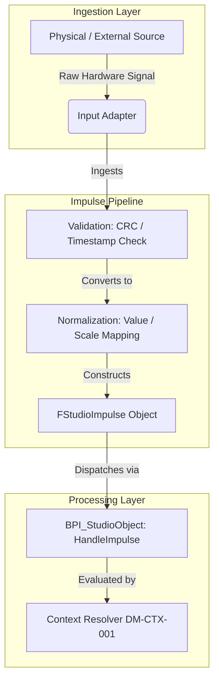

# RVPF Domain Model: Impulse Model
**Document ID:** DM-IMP-001  
**Title:** RVPF Impulse Model  
**Version:** 0.1  
**Status:** Stable  
**Artifact Type:** Domain Model  
**Author:** Olaf Erler  
**Maintainer:** Olaf Erler  
**Artifact Owner:** Olaf Erler  
**Created:** 2026-08-27  
**Last Modified:** 2026-08-27  
**Depends on:** CS-001, GLS-001  
**Referenced by:** DM-CTX-001, DM-OBJ-001, RA-001, ADR-002  
**Approval:** Accepted  

---

## 1. Purpose
The Impulse Model defines the foundational telemetry and data acquisition contract for the Responsive Virtual Production Framework (RVPF). In strict alignment with Core Principle 1 and ADR-002, the framework treats all incoming signals initially as semantically neutral temporal data points. The Impulse Model establishes a protocol-agnostic, normalized representation of incoming information before any domain-specific or contextual interpretation occurs.

---

## 2. Document Scope
**This document defines:**
* The formal definition and structural properties of an `Impulse` (`FStudioImpulse`).
* The taxonomy of Impulse Sources and Information Types.
* The multi-stage Impulse Lifecycle and Normalization pipeline.
* The operational boundary between transient impulses and persistent domain states.

**This document explicitly does not define:**
* Contextual evaluation or state transitions (See `DM-CTX-001`, `DM-STM-001`).
* Concrete network socket or driver-level hardware implementations (See `IL-001`).
* Rule execution or actuator commands (See `RA-001`).

---

## 3. Normative References
| ID | Title | Relation / Description |
| :--- | :--- | :--- |
| **CS-001** | RVPF Core Specification | Foundational constraints (Principle 1 & Conformance 6.2) |
| **GLS-001** | RVPF Glossary | Authoritative domain terminology (`Impulse`, `Normalization`, `Telemetry`) |
| **ADR-002** | Architecture Decision Record | Semantic neutrality of incoming impulses |
| **GOV-001** | RVPF Governance | Lifecycle, versioning, and approval rules |

---

## 4. Impulse Definition and Structural Schema
An Impulse is an immutable, semantically neutral information vector representing a discrete temporal occurrence. It serves as a normalized payload across all input channels.

| Property | Data Type | Description |
| :--- | :--- | :--- |
| **ImpulseID** | `FGuid` | Unique identification for tracking and auditing. |
| **Timestamp** | `FDateTime` / `FTimecode` | Precise point of temporal occurrence. |
| **Source** | `EImpulseSource` / `FString` | Identifier of the originating device or system. |
| **InformationType** | `EImpulseType` | Semantic classification of the contained data. |
| **Payload** | `TArray<uint8>` / `FVector4` | Normalized raw data payload. |
| **Confidence** | `float` (0.0 .. 1.0) | Measurement quality or validity metric (e.g., optical tracking confidence). |
| **Metadata** | `TMap<FString, FString>` | Optional non-functional tags and attributes. |

---

## 5. Impulse Taxonomy

### 5.1 Impulse Sources
| Source Category | Origin Systems | Typical Protocol / Interface |
| :--- | :--- | :--- |
| **User Input** | MIDI Faders, StreamDecks, Touchscreens, Gamepads | MIDI, HID, OSC, WebSocket |
| **Sensor Systems** | Tracking clusters, camera telemetry, microphones | Live Link, FreeD, UDP, Audio Stream |
| **External Systems** | QLab, TouchDesigner, Max/MSP, Companion | OSC, TCP/IP, REST, Art-Net |
| **StudioObject** | Internal lifecycle changes, capability faults, health reports | Native Framework Events / Delegates |
| **System / Engine** | Sequencer triggers, timeline ticks, heartbeats | Engine Timecode, Internal Clocks |

### 5.2 Information Types
| Information Type | Description | Normalized Representation |
| :--- | :--- | :--- |
| **Trigger** | Instantaneous binary impulse (e.g., button press, note-on). | `Boolean` / `TriggerFlag` |
| **Scalar / Value** | Normalized continuous single-axis values (0.0 to 1.0). | `Float` |
| **Spatial / Pose** | Positional and rotational vectors in reference space. | `FTransform` (`FVector`, `FRotator`) |
| **State** | Discrete operational or connectivity status updates. | `EStudioLifecycle` / Status Enum |
| **Media Stream** | Continuous image, audio level, or depth buffers. | Frame Buffers / Audio Buffers |
| **Temporal** | Synchronized master timecode markers. | `FTimecode` |

---

## 6. Impulse Ingestion Pipeline

---
## 7. Scope Boundaries (What an Impulse Is NOT)
| Entity | Classification | Rationale |
| :--- | :--- | :--- |
| **Role** | Structural Metadata | Static property of a `StudioObject`; does not represent transient telemetry. |
| **Capability** | Contractual Interface | Describes functional potential, not temporal data occurrences. |
| **Event** | Semantic State Change | Events are generated *after* contextual evaluation; impulses have no inherent business meaning. |
| **Relationship** | Topology Model | Persistent link between studio entities; not a data packet. |

---

## 8. Traceability Mapping
| Core Principle / Constraint                                 | Realized In / Handled By                    | Conformance Criteria                                                                                   |
| :---------------------------------------------------------- | :------------------------------------------ | :----------------------------------------------------------------------------------------------------- |
| **Principle 1: Impulses have no semantic meaning** | `FStudioImpulse` / `DM-IMP-001` | Raw inputs are ingested without direct business logic execution.                           |
| **Principle 6: Interchangeable implementations**   | Normalization Layer (Section 6)    | MIDI, DMX, OSC, and Live Link inputs produce identical normalized scalar/spatial payloads. |