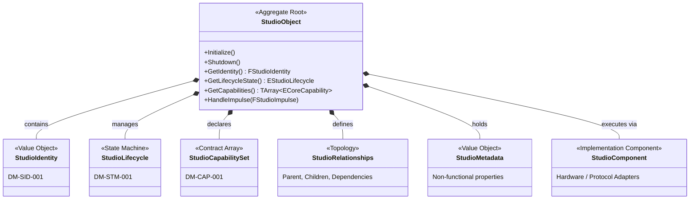

# RVPF Domain Model: StudioObject Specification
**Document ID:** DM-OBJ-001  
**Title:** RVPF StudioObject Specification  
**Version:** 0.1  
**Status:** Stable  
**Artifact Type:** Domain Model  
**Author:** Olaf Erler  
**Maintainer:** Olaf Erler  
**Artifact Owner:** Olaf Erler  
**Created:** 2026-08-27  
**Last Modified:** 2026-08-27  
**Depends on:** CS-001, GLS-001, DM-CAP-001, DM-STM-001, DM-SID-001, DM-IMP-001  
**Referenced by:** RA-001  
**Approval:** Accepted  

---

## 1. Purpose
The `StudioObject` is the central semantic entity (Aggregate Root) of the Responsive Virtual Production Framework (RVPF). It serves as the digital representation of any physical, virtual, or hybrid entity operating within the studio ecosystem. 

By abstracting real-world hardware and virtual assets into a unified object model, the `StudioObject` defines identity, capabilities, and states completely independent of technical implementations (e.g., DMX, MIDI, OSC). It encapsulates the domain logic required to receive normalized impulses and react to contextual changes, forming the foundation of the framework's semantic layer.

---

## 2. Document Scope
**This document defines:**
* The structural composition of the `StudioObject` Aggregate Root.
* The invariant rules governing its internal state and capability sets.
* The minimal public interface (`BPI_StudioObject`) required for interaction.
* The functional separation between the semantic object and its technical Implementation Components.

**This document explicitly does not define:**
* Immutable identification properties (See `DM-SID-001`).
* Dynamic lifecycle transitions (See `DM-STM-001`).
* Specific capability contracts (See `DM-CAP-001`).
* Contextual evaluation rules (See `DM-CTX-001`).

---

## 3. Normative References
| ID | Title | Relation / Description |
| :--- | :--- | :--- |
| **CS-001** | RVPF Core Specification | Principle 5: StudioObjects as core entities |
| **GLS-001** | RVPF Glossary | Definition of Aggregate Root, Asset, and Component |
| **ADR-001** | Architecture Decision Record | Separation of domain state from hardware communication |
| **GOV-001** | RVPF Governance | Lifecycle, versioning, and traceability rules |

---

## 4. Core Composition & Structural Model
In accordance with Domain-Driven Design (DDD) principles, the `StudioObject` acts as an Aggregate Root. It does not execute hardware commands directly, but aggregates the models that describe the entity.

---

### 4.1 Composition Domains
| Domain | Description | Architectural Artifact |
| :--- | :--- | :--- |
| **Identity** | The immutable description (Value Object) containing ID, Name, Role, Manufacturer, Model, and Physical/Virtual flags. | `DM-SID-001` |
| **Lifecycle** | A state machine tracking operational readiness (e.g., Created, Connected, Active, Error). | `DM-STM-001` |
| **Capabilities** | An array of abstract contracts defining *what* the object can do (e.g., Capture, Emit, Track). | `DM-CAP-001` |
| **Relationships** | Defines the studio topology via Parent, Children, and Dependencies (e.g., Tracker attached to Camera). | `FStudioRelationships` |
| **Metadata** | Non-functional properties (e.g., technical interface type, physical connection status). | `FStudioMetadata` |
| **Components** | Modular technical adapters attached to the object handling hardware communication (e.g., `DMXComponent`). | `/Implementation` |

---

## 5. Public Interface (`BPI_StudioObject`)
To ensure loose coupling and universal interaction within the RVPF, every `StudioObject` **SHALL** implement the `BPI_StudioObject` interface. This minimal API exposes identity and state without exposing internal technical implementations.

| Operation | Input | Return Type | Responsibility |
| :--- | :--- | :--- | :--- |
| **Initialize()** | None | `void` | Brings the object into a defined initial state. |
| **Shutdown()** | None | `void` | Cleans up resources, network sockets, and timers. |
| **GetIdentity()** | None | `FStudioIdentity` | Returns the immutable identity struct (`DM-SID-001`). |
| **GetLifecycleState()** | None | `EStudioLifecycle` | Returns the current operational state (`DM-STM-001`). |
| **GetCapabilities()** | None | `TArray<ECoreCapability>` | Returns the array of supported functional contracts. |
| **HandleImpulse()** | `FStudioImpulse` | `void` | The universal entry point for all incoming normalized data (`DM-IMP-001`). |

---

## 6. Architectural Constraints
* **ADR-001 Conformance:** The `StudioObject` **SHALL NOT** contain protocol parsing logic (e.g., DMX addressing, MIDI decoding). All hardware-specific execution MUST be delegated to attached Implementation Components (`StudioComponent`).
* **Event Reception vs. Dispatch:** The `StudioObject` acts as the receiver of `StudioImpulses`. It does not route or broadcast raw telemetry; it evaluates impulses and transitions its internal state accordingly.
* **Capability Abstraction:** The object exposes what it can do via `StudioCapabilitySet` rather than what it is (e.g., exposing an `Emit` capability rather than declaring itself a "Lamp").

---

## 7. Traceability Mapping
| Core Principle / Requirement                          | Realized In / Handled By         | Conformance Criteria                                                                       |
| :---------------------------------------------------- | :------------------------------- | :----------------------------------------------------------------------------------------- |
| **Principle 5: StudioObjects as core entities**       | `StudioObject` Aggregate Root    | All physical/virtual studio elements are represented via this unified model.               |
| **ADR-001: Separation of domain state from hardware** | Composition of `StudioComponent` | The base object contains no hardware logic; it delegates to components.                    |
| **Universal Impulses**                                | `HandleImpulse(FStudioImpulse)`  | Object evaluates standardized impulses without knowing if the source was MIDI, DMX, or UI. |