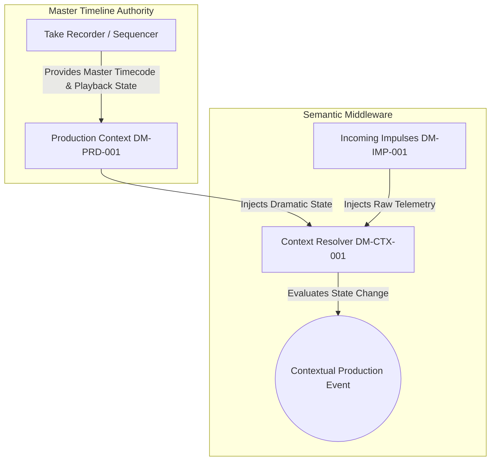
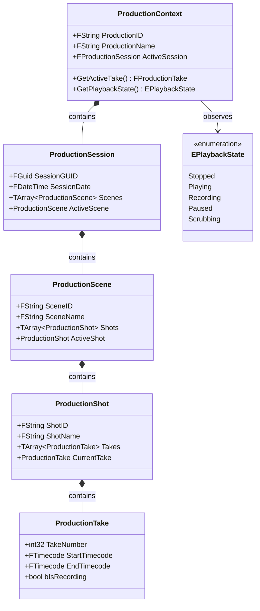

# RVPF Domain Model: Production Context Specification
**Document ID:** DM-PRD-001
**Title:** RVPF Production Model Specification
**Version:** 0.1
**Status:** Stable
**Artifact Type:** Domain Model
**Author:** Olaf Erler
**Maintainer:** Olaf Erler
**Artifact Owner:** Olaf Erler
**Created:** 2026-08-27
**Last Modified:** 2026-08-27
**Depends on:** CS-001, GLS-001
**Referenced by:** DM-CTX-001, DM-STM-001, RA-001
**Approval:** Accepted

---

## 1. Purpose
The Production Model defines the overarching dramatic and temporal framework of the Responsive Virtual Production Framework (RVPF). While sensors and input devices continuously deliver semantically neutral telemetry, these inputs acquire operational meaning strictly when interpreted within the active production situation. An identical technical impulse can have fundamentally different consequences depending on the active Scene, Shot, Take, or Playback State.

---

## 2. Document Scope
**This document defines:**
* The hierarchical layers of a production lifecycle (Production, Session, Scene, Shot, Take, Playback State).
* The role of real-time execution engines (Sequencer and Take Recorder) as the temporal ground truth of the production.
* The synchronization boundary between dramatic timeline progression and incoming telemetry.
* The structural composition of production metadata.

**This document explicitly does not define:**
* Lower-level localized context classes such as Spatial, Device, or User context (See `DM-CTX-001`).
* Concrete hardware communication protocols or network transports (See `IL-001`).
* Actuator execution rules and command routing (See `RA-001`).

---

## 3. Normative References
| ID | Title | Relation / Description |
| :--- | :--- | :--- |
| **CS-001** | RVPF Core Specification | Foundational principles (Principle 2: Context determines meaning) |
| **GLS-001** | RVPF Glossary | Authoritative domain terminology (`Production Context`, `Take`, `Timeline`) |
| **GOV-001** | RVPF Governance | Lifecycle, versioning, and traceability rules |

---

## 4. The Master Timeline & Temporal Truth
In traditional setups, the Sequencer is primarily treated as an animation tool. Within the RVPF, the Sequencer and Take Recorder serve a more fundamental architectural role: they establish the **temporal truth** of the entire production.

All impulses occur within this temporal framework. Instead of a signal merely triggering an isolated action (e.g., *“MIDI triggers explosion”*), the framework contextualizes the event: *“During Take 14, Shot 6, at Timecode xx:xx:xx:xx, an impulse occurs”*.

---

## 5. Production Hierarchy
The Production Model is structured top-down into six hierarchical layers:

| Layer | Domain Entity | Description | Architectural Scope |
| :--- | :--- | :--- | :--- |
| **1** | **Production** | The root container representing the entire creative project. | Global metadata, show configurations, show namespaces. |
| **2** | **Session** | A distinct working period, operational shoot day, or stage block. | Date-specific calibrations, stage layout revisions. |
| **3** | **Scene** | The dramatic, narrative, or thematic unit currently being executed. | Lighting mood, virtual environment level, audio ambiance. |
| **4** | **Shot** | A specific camera framing, angle setup, or action segment within a scene. | Active camera assignments, tracker offsets, focal ranges. |
| **5** | **Take** | A single continuous recorded iteration of a shot. | Recording state, iteration counter, asset record targets. |
| **6** | **Playback State** | The real-time operational status of the temporal master reference. | `Stopped`, `Playing`, `Recording`, `Scrubbing`, `Paused`. |

---

## 6. Structural Domain Schema

---
## 7. Traceability Mapping
| Core Principle / Requirement | Realized In / Handled By | Conformance Criteria |
| :--- | :--- | :--- |
| **Principle 2: Context determines meaning**[cite: 1, 2] | `ProductionContext` / `DM-PRD-001`[cite: 2] | Evaluates incoming impulses against the active dramatic state (Scene, Shot, Take) before generating events[cite: 2]. |
| **Principle 6: Interchangeable implementations**[cite: 1, 2] | Abstraction of Playback & Master Timeline (Section 4 & 5)[cite: 2] | Timecode and playback state definitions remain engine-agnostic and map cleanly to Sequencer, Take Recorder, or external SMPTE master clocks[cite: 1, 2]. |
