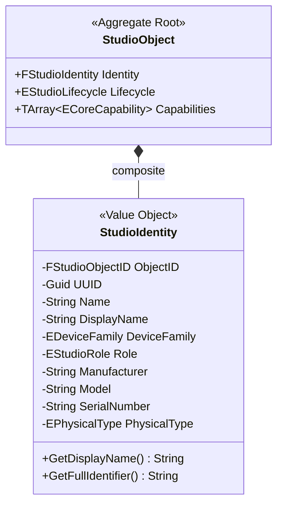

# RVPF Domain Model: Studio Identity Specification
**Document ID:** DM-SID-001  
**Title:** RVPF Studio Identity Specification  
**Version:** 0.1  
**Status:** Stable  
**Artifact Type:** Domain Model  
**Author:** Olaf Erler  
**Maintainer:** Olaf Erler  
**Artifact Owner:** Olaf Erler  
**Created:** 2026-08-27  
**Last Modified:** 2026-08-27  
**Depends on:** CS-001, GLS-001  
**Referenced by:** DM-OBJ-001, RA-001, ADR-001  
**Approval:** Accepted  

---

## 1. Purpose
The Studio Identity Specification defines the immutable identity model for all entities within the Responsive Virtual Production Framework (RVPF). In accordance with Core Principle 5 and Domain-Driven Design (DDD) principles, `StudioIdentity` is modeled strictly as a **Value Object**. It answers exclusively the question *"Who am I?"* and encapsulates all static descriptive attributes, remaining completely independent of dynamic operational state, runtime capabilities, or technical communication protocols.

---

## 2. Document Scope
**This document defines:**
* The structural properties and schema of `FStudioIdentity`.
* The distinction between human-readable domain identifiers (`ObjectID`), technical identifiers (`UUID`), and presentation labels (`DisplayName`).
* The taxonomies for Physical/Virtual categorization (`EPhysicalType`), Device Families (`EDeviceFamily`), and Studio Roles (`EStudioRole`).
* The immutability constraints and composition lifecycle within the `StudioObject` Aggregate Root.

**This document explicitly does not define:**
* Dynamic operational lifecycles or state transitions (See `DM-STM-001`).
* Functional behavioral contracts or capabilities (See `DM-CAP-001`).
* Mutable technical configurations like DMX addresses, IP addresses, or COM ports (See `IL-001`).

---

## 3. Normative References
| ID | Title | Relation / Description |
| :--- | :--- | :--- |
| **CS-001** | RVPF Core Specification | Foundational constraints (Principle 5: StudioObjects as central domain entities) |
| **GLS-001** | RVPF Glossary | Authoritative domain terminology (`StudioIdentity`, `Value Object`, `Aggregate Root`) |
| **ADR-001** | Architecture Decision Record | Separation of business state/identity from hardware communication |
| **GOV-001** | RVPF Governance | Lifecycle, versioning, and traceability rules |

---

## 4. Structural Model & Schema
`StudioIdentity` contains exclusively static descriptive data. It provides no mutating methods and has no independent lifecycle outside of its parent `StudioObject`.

---
### 4.1 Attribute Specification
| Attribute | Type | Mutability | Description | Architectural Example |
| :--- | :--- | :--- | :--- | :--- |
| **ObjectID** | `FStudioObjectID` / `String` | Immutable | Structured domain identifier within the studio registry. | `L001`, `CAM_002`, `TRK_001` |
| **UUID** | `FGuid` | Immutable | Globally unique technical identifier for persistence and digital twins. | `550e8400-e29b-41d4-a716-446655440000` |
| **Name** | `FString` | Immutable | Technical identifier name used in project namespaces. | `SkyPanelS60C_Key` |
| **DisplayName** | `FString` | Read-Only | Human-readable presentation label for UI and operator dashboards. | `ARRI SkyPanel S60-C Keylight` |
| **DeviceFamily** | `EDeviceFamily` | Immutable | Broad functional classification of the entity. | `Actuator`, `Sensor`, `Gateway` |
| **Role** | `EStudioRole` | Immutable | Domain-specific studio role defining operational purpose. | `Light`, `Camera`, `Tracking`, `Audio` |
| **Manufacturer** | `FString` | Immutable | Physical vendor or software ecosystem creator. | `ARRI`, `Canon`, `HTC`, `Epic Games` |
| **Model** | `FString` | Immutable | Specific hardware model or software module designation. | `S60-C`, `EOS 5D MK IV`, `Mars Rover` |
| **SerialNumber** | `FString` | Immutable | Physical hardware serial number (optional for virtual assets). | `SN-984214-X` |
| **PhysicalType** | `EPhysicalType` | Immutable | Tangibility flag defining physical vs. virtual nature. | `Physical`, `Virtual`, `Hybrid` |

---

## 5. Taxonomies & Enumerations

### 5.1 Device Family (`EDeviceFamily`)
* **Sensor:** Ingests physical or spatial telemetry into the framework (e.g., Cameras, Trackers, Microphones).
* **Actuator:** Executes physical or digital output based on framework decisions (e.g., Fixtures, Speakers, LED Walls).
* **Gateway:** Bridges and translates communication protocols without originating telemetry (e.g., Art-Net Nodes, OSC Bridges).
* **Interaction Device:** Human-machine interface surfaces for manual control (e.g., MIDI Faders, StreamDecks).

### 5.2 Studio Role (`EStudioRole`)
* `Camera`: Optical capture systems (physical CineCameras, virtual render targets).
* `Light`: Photometric emitting systems (DMX fixtures, Unreal light actors).
* `Tracking`: Spatial position, rotation, and kinematic systems (Vive Mars, MoCap rigs).
* `Audio`: Acoustic acquisition or playback systems.
* `Display`: Direct-view presentation systems (LED Volumes, Stage Monitors).
* `Simulation`: Virtual physics and generative elements (Niagara systems, physics solvers).

### 5.3 Physical Type (`EPhysicalType`)
* `Physical`: Hardware entity deployed in the physical studio space.
* `Virtual`: Pure software/digital entity existing exclusively in the real-time engine.
* `Hybrid`: Composite entity coupling physical hardware directly with a real-time digital twin.

---

## 6. Compositional Rules & Identity Invariant
1. **Immutability Invariant:** Once instantiated, the attributes of a `StudioIdentity` struct **SHALL NOT** be modified during runtime. Any change to `Manufacturer`, `Model`, or `Role` constitutes the destruction of the existing entity and instantiation of a new `StudioObject`.
2. **Composition Boundary:** `StudioIdentity` is owned entirely by its parent `StudioObject` Aggregate Root (`StudioObject ◆── StudioIdentity`). External callers must access identity properties exclusively through the public `BPI_StudioObject:GetIdentity()` interface method.
3. **Exclusion of Transient State:** Hardware communication parameters (e.g., IP address, DMX universe/channel, baud rate) are mutable configuration properties and **SHALL NOT** be included in `StudioIdentity`.

---

## 7. Traceability Mapping
| Core Principle / Constraint                                           | Realized In / Handled By                                       | Conformance Criteria                                                                                                  |
| :-------------------------------------------------------------------- | :------------------------------------------------------------- | :-------------------------------------------------------------------------------------------------------------------- |
| **Principle 5: StudioObjects are the central domain entity** | `FStudioIdentity` Value Object                        | Every physical and virtual entity has an immutable identity struct attached to its aggregate root.           |
| **Principle 6: Interchangeable implementations**             | Abstraction of `Manufacturer` and `Model` as metadata | No hardware-specific Blueprint classes; physical and virtual entities share the identical identity contract. |
| **ADR-001: Separation of State and Communication**           | Exclusion of protocol addressing                      | DMX, MIDI, and OSC addressing parameters reside strictly in external components, keeping identity pure.      |