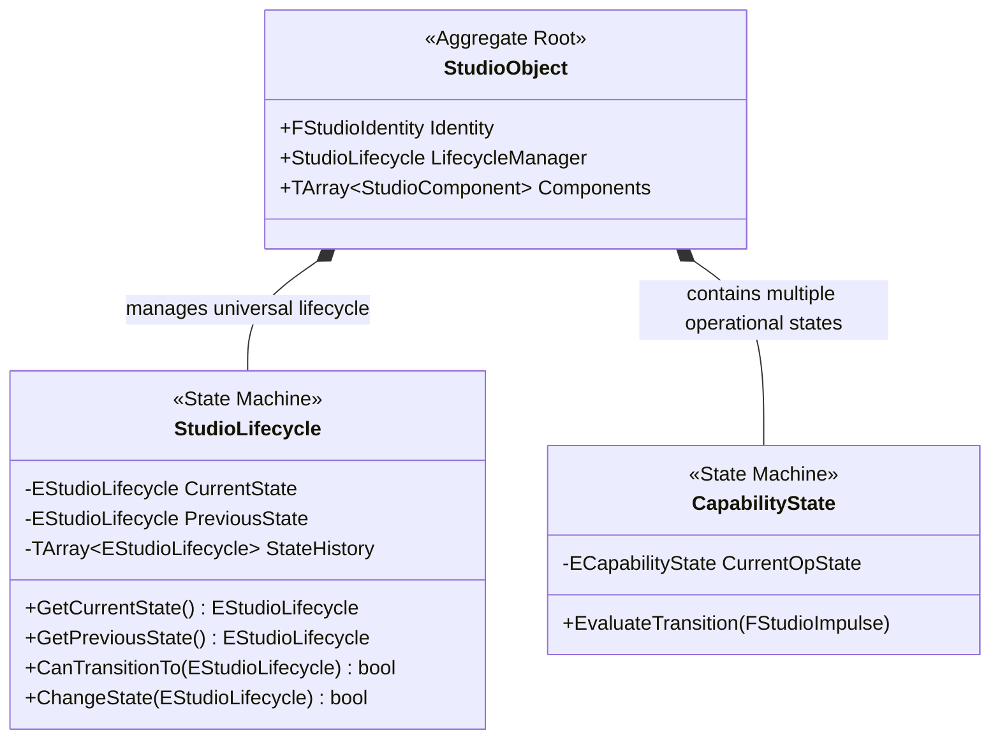
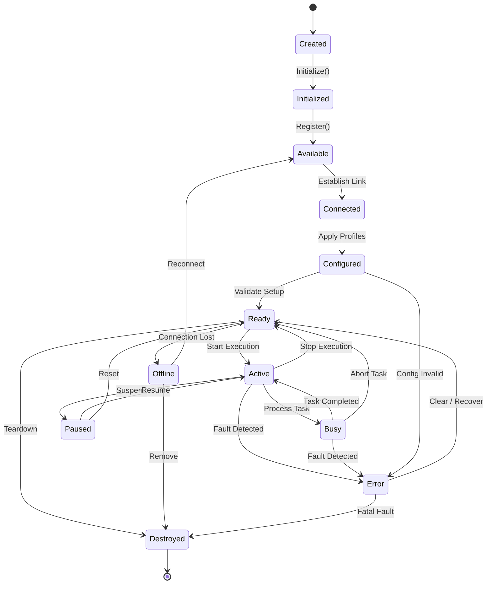

# RVPF Domain Model: State Model Specification
**Document ID:** DM-STM-001  
**Title:** RVPF State Model Specification  
**Version:** 0.1  
**Status:** Stable  
**Artifact Type:** Domain Model  
**Author:** Olaf Erler  
**Maintainer:** Olaf Erler  
**Artifact Owner:** Olaf Erler  
**Created:** 2026-08-27  
**Last Modified:** 2026-08-27  
**Depends on:** CS-001, GLS-001, DM-CTX-001  
**Referenced by:** DM-OBJ-001, DM-CAP-001, RA-001  
**Approval:** Accepted  

---

## 1. Purpose
The State Model defines the dynamic runtime behavior, state transition rules, and execution lifecycle for all entities within the Responsive Virtual Production Framework (RVPF). In accordance with Core Principle 3, the framework models events strictly as semantic interpretations of state transitions. The State Model establishes a deterministic state machine architecture separating overarching entity lifecycles from specialized capability states.

---

## 2. Document Scope
**This document defines:**
* The distinction between universal `Lifecycle States` (managed by `StudioObject`) and domain-specific `Operational States` (managed by `Capabilities`).
* The formal schema and deterministic transition rules of the `StudioLifecycle` state machine.
* The allowable and forbidden state transition matrix.
* The causality chain linking incoming impulses, state evaluation, transition execution, and event dispatching.

**This document explicitly does not define:**
* Immutable structural identifiers or vendor metadata (See `DM-SID-001`).
* Concrete protocol parsing or hardware interface adapters (See `IL-001`).
* Production dramatic context (Scene, Shot, Take) (See `DM-PRD-001`).

---

## 3. Normative References
| ID | Title | Relation / Description |
| :--- | :--- | :--- |
| **CS-001** | RVPF Core Specification | Foundational principles (Principle 3: Events describe state transitions) |
| **GLS-001** | RVPF Glossary | Authoritative domain terminology (`State`, `Lifecycle`, `State Transition`, `Event`) |
| **DM-CTX-001** | Context Model | Upstream semantic evaluation providing context for state changes |
| **GOV-001** | RVPF Governance | Lifecycle, versioning, and approval rules |

---

## 4. Two-Tier State Architecture
The RVPF strictly separates global lifecycle management from localized functional execution:

---
### 4.1 Invariant Rule of State Management
> **An entity (`StudioObject`) possesses exactly one Lifecycle State at any given time, while concurrently maintaining multiple independent Operational States across its attached Capabilities.**

---

## 5. Universal Lifecycle State Machine
Every `StudioObject` implements an identical, deterministic finite state machine (`EStudioLifecycle`).

---
### 5.1 Lifecycle State Taxonomy (`EStudioLifecycle`)
| State | Description | Invariant / Allowable Activity |
| :--- | :--- | :--- |
| **Created** | Entity struct/class instantiated in memory. | No component execution; memory allocation only. |
| **Initialized** | Internal default variables and identifiers assigned. | Value objects attached; no hardware I/O allowed. |
| **Available** | Registered in Studio Object Registry. | Discovery phase; address known to middleware. |
| **Connected** | Physical or logical transport channel established. | Socket/Port open (e.g., Art-Net, Live Link active). |
| **Configured** | Calibration profiles, universes, and roles mapped. | Offsets applied; ready for validation. |
| **Ready** | Fully verified and operational baseline achieved. | Awaiting production execution or cue trigger. |
| **Active** | Currently utilized in live evaluation or timeline playback. | Handling impulses and executing actions. |
| **Busy** | Executing a blocking or dedicated atomic task. | Processing calibration routines, file I/O, or homing. |
| **Paused** | Temporarily suspended execution loop. | Holding last frame/state; no new commands processed. |
| **Error** | Operational fault or invalid telemetry encountered. | Fault-handling logic active; output safe-state forced. |
| **Offline** | Transport connection dropped or device powered down. | Re-acquisition logic active. |
| **Destroyed** | Unregistered and purged from memory. | Terminal state; cannot be reactivated. |

---

## 6. Permitted State Transitions
Transitions are strictly evaluated via `CanTransitionTo()`. Arbitrary state jumps are forbidden to prevent invalid production states.

| From State | Allowable Target States | Triggering Condition / Method |
| :--- | :--- | :--- |
| **Created** | `Initialized`, `Destroyed` | `Initialize()`, `Shutdown()` |
| **Initialized** | `Available`, `Destroyed` | `Register()`, `Shutdown()` |
| **Available** | `Connected`, `Offline`, `Destroyed` | `Connect()`, Transport Timeout, `Unregister()` |
| **Connected** | `Configured`, `Offline`, `Error`, `Destroyed` | `Configure()`, Disconnect, Socket Fault |
| **Configured** | `Ready`, `Connected`, `Error`, `Destroyed` | `Validate()`, Re-configure, Parse Error |
| **Ready** | `Active`, `Offline`, `Error`, `Destroyed` | `Activate()`, Connection Lost, Hardware Fault |
| **Active** | `Ready`, `Busy`, `Paused`, `Error` | `Deactivate()`, `BeginTask()`, `Pause()`, Runtime Fault |
| **Busy** | `Active`, `Ready`, `Error` | `EndTask()`, `Abort()`, Execution Failure |
| **Paused** | `Active`, `Ready`, `Error` | `Resume()`, `Reset()`, Timeout |
| **Error** | `Ready`, `Available`, `Destroyed` | `Reset()`, Re-initialization, Fatal Terminate |
| **Offline** | `Connected`, `Available`, `Destroyed` | Reconnect, Re-discovery, Remove |
| **Destroyed** | *(None — Terminal State)* | Garbage Collection / Deallocation |

---

## 7. Operational States (Capability Level)
While lifecycle states govern the container, capabilities execute autonomous state logic:

| Capability Type | Specialized Operational States | Operational Transition Example |
| :--- | :--- | :--- |
| **Capture** | `Idle` ➔ `Capturing` ➔ `Recording` ➔ `Streaming` | Camera starts take recording. |
| **Emit** | `Off` ➔ `Transitioning` ➔ `On` ➔ `EffectRunning` | Light fixture triggers fire flicker cue. |
| **Track** | `Tracking` ➔ `Lost` ➔ `Reacquiring` ➔ `Calibrating` | Tracker loses line of sight to base stations. |
| **Interact** | `Listening` ➔ `InputActive` ➔ `FeedbackActive` | Fader moved by operator. |

---

## 8. Traceability Mapping
| Core Principle / Constraint | Realized In / Handled By | Conformance Criteria |
| :--- | :--- | :--- |
| **Principle 3: Events describe state transitions** | `StudioLifecycle:ChangeState()` & `DM-STM-001` | Events are raised exclusively upon a successful transition in `EStudioLifecycle` or `ECapabilityState`. |
| **Principle 5: StudioObjects as core entities** | `StudioLifecycle` Composition (`StudioObject ◆── StudioLifecycle`) | Every registered object maintains its own isolated lifecycle machine instance. |
| **ADR-003: Events from Context Changes** | State Transition Engine (Section 5 & 6) | Incoming telemetry cannot bypass state validation to trigger downstream events directly. |